# Architettura degli elaboratori

_Matteo Lombardi_

## Indice

1.0 - Introduzione

1.1 - Approccio strutturale

1.2 - Unità di misura

1.3 - Storia degli elaboratori

1.4 - Tipologie di elaboratori attualmente disponibili

2.0 - Organizzazione dei sistemi di calcolo

2.1 - Processore

2.2 - Memorie

2.3 - Dispositivi di input e output

3.0 - Porte logiche e circuiti combinatori

3.1 - Algebra di Boole

3.2 - Tabella di verità e formula canonica

3.3 - Porte logiche

3.4 - Mappa di Karnaugh e formula minimale

4.0 - Rappresentazione dell’informazione

4.1 - Numeri interi

4.2 - Numeri con la virgola

4.3 - Caratteri

4.4 - Codici correttori

5.0 - Circuiti sequenziali

5.1 - Latch

5.2 - Flip-Flop

5.3 - Registri e memorie

6.0 - Microarchitettura

6.1 - Microarchitettura del processore Hack

6.2 - Organizzazione delle memorie

6.3 - Microarchitetture moderne, prefetch e pipeline

7.0 - Livello ISA (Instruction Set Architecture)

7.1 - IS (Instruction Set) del computer Hack

7.2 - ISA (Instruction Set Architecture) generale

7.3 - ISA (Instruction Set Architecture) del computer Hack

7.4 - Assemblatore

7.4.1 - Assemblatore del computer Hack

7.4.2 - Programmazione in C

8.0 - Sistema operativo

8.1 - Paginazione

8.2 - Segmentazione

8.3 - Collegamento di un programma

9.0 - Virtual Machine

9.1 - Linguaggio per virtual machine

9.2 - Modello a stack

9.3 - Subroutine

10.0 - Debugging

10.1 - Errori nei programmi

10.2 - Tecniche di debugging

## Contenuti

- **1.0 - Introduzione**
  L’architettura degli elaboratori consiste nello studio della progettazione delle parti di un computer visibili ai programmatori.

- **1.1 - Approccio strutturale**

### Introduzione all’approccio strutturale

Un **elaboratore** consiste in una macchina capace di effettuare operazioni eseguendo delle istruzioni che le vengono assegnate (l’insieme di queste istruzioni è detto programma).
Un elaboratore è capace di risolvere solo programmi composti da un set di istruzioni molto semplice, che corrispondono al linguaggio macchina.
Per far eseguire ad un elaboratore un programma costituito da istruzioni molto complesse viene utilizzato un **approccio strutturale**, il quale consiste nello strutturare il calcolatore utilizzando diversi **livelli di astrazione**, ciascuno costruito a partire da quello sottostante.
A questo punto dunque sorge un problema: come far eseguire il set di istruzioni scritte in un livello più alto all’elaboratore, il quale comprende solamente istruzioni in linguaggio macchina?

- **Traduzione**
  La traduzione, effettuata da un **compilatore**, consiste nell’attività di tradurre tutto il programma, passando per i livelli intermedi, in linguaggio macchina prima di essere eseguito.
- **Interpretazione**
  L’interpretazione, effettuata da un **interprete**, consiste nel tradurre una singola istruzione del programma ed eseguirla, per poi passare a quella successiva.

### I livelli di astrazione dell’elaboratore


- **Livello 0 - Porte logiche.**
  Il primo livello che noi consideriamo è quello composto dalle porte logiche, tuttavia esistono dei livelli sottostanti il quale studio ricade però nell’ambito dell’elettronica e della fisica.
  Le porte logiche sono infatti composte da **transistor**, i quali sono dei semiconduttori che regolano il voltaggio della corrente in modo da generare segnali elettrici. Diverse porte unite insieme permettono inoltre di formare 1 bit di informazione.
- **Livello 1 - Microarchitettura.**
  Il livello di microarchitettura è composto da una **memoria** formata da un insieme di registri e da una **ALU (Arithmetic Logic Unit)**, la quale opera eseguendo istruzioni sui dati presenti in memoria.
  Per far comunicare la ALU con la memoria è necessario un **percorso dati**, il quale può essere controllato sia lato software, tramite un microprogramma, che lato hardware.
- **Livello 2 - Livello ISA.**
  Rappresenta l’interfaccia tra l’hardware e il software di un elaboratore, in quanto è composto da un insieme di istruzioni eseguibili dalla microarchitettura.
- **Livello 3 e 4 - Livelli ibridi.**
  I livelli 3-4 sono chiamati livelli ibridi in quanto non sono nettamente separati e sono composti principalmente da:
- **Sistema operativo**
  Fornisce una serie di servizi che permettono di gestire le **risorse** (memoria, CPU, dispositivi di I/O ecc.) ed eseguire **processi**.
- **Linguaggio assemblativo**
  Permette di programmare per i livelli sottostanti in maniera più semplice utilizzando un linguaggio più di alto livello.
- **Livello 5 - Linguaggi di alto livello.**
  Il livello 5 è formato da quei linguaggi di programmazione detti “di alto livello”, tra i quali troviamo C, C++, Java ecc.

- **1.2 - Unità di misura**
  **MIPS**: milioni di operazioni per secondo
  **GFLOPS**: miliardi di operazioni floating-point per secondo
- **1.3 - Storia degli elaboratori**
- **Generazione 0 - Computer meccanici**
  - 1600 - Creazione delle prime macchine che permettevano di fare **calcoli matematici**
  - 1800 - Prima macchina con una struttura simile agli elaboratori moderni, la quale comprendeva:
    - **Magazzino** (piccolo storage)
    - **Mulino** (unità computazionale)
    - Dispositivo di **input** (schede perforate)
    - Dispositivo di **output** (stampa o schede perforate)
- **Generazione 1 - Computer basati su valvole**
  - **Colossus**: primo elaboratore digitale basato sull’**elettromagnetismo**. Venne ideato da Alan Turing al fine di decifrare i messaggi inviati dai tedeschi durante la seconda guerra mondiale.
  - **Architettura di Von Neumann**, sulla quale si baseranno quasi tutti gli elaboratori che verranno utilizzati in seguito.
    
- **Generazione 2 - Computer basati su transistor**
  - Creazione delle prime **macchine parallele** con diverse unità funzionali preposte a compiti diversi.
- **Generazione 3 - Computer basati su circuiti integrati**
  - Utilizzo della **multiprogrammazione**: mentre si aspetta l’input/output di un programma se ne può eseguire un altro.
  - Utilizzo della microprogrammazione per emulare dei modelli precedenti di pc (utilizzato da IBM per i suoi computer)
- **Generazione 4 - Computer basati su VSLI**
  - **VSLI (Very Large Scale Integration)**: possibilità di inserire una grande mole di transistor in un unico chip
    - L’evoluzione nel numero di transistor presenti in un chip ha seguito la **legge di Moore**, secondo la quale la quantità di transistor in un chip aumenta del 60% ogni anno.
- **Generazione 5 - Computer ubiqui e invisibili**
  - **Computer ubiqui**: dispositivi economici ma con una grande potenza di calcolo (smartphone, tablet ecc.).
  - **Computer invisibili**: dispositivi conosciuti per le loro funzionalità piuttosto che per le loro architetture di calcolo.
- **1.4 - Tipologie di elaboratori attualmente disponibili**
  Dal meno potente al più potente:
- Computer **usa e getta** (Qualche MIPS)
- Sistemi **embedded** (1 - 100 MIPS)
- **Smartphone e tablet** (10k - 100k MIPS)
- **Console da gioco** (200 - 1000 GFLOPS)
- **Pc** (100 - 1000 GFLOPS)
- **Server e workstation** (200 GFLOPS - 20 TFLOPS)
- **Cluster** (raggruppamento) **di server** (500 GFLOPS - 50 TFLOPS)

- **2.0 - Organizzazione dei sistemi di calcolo**
  Un **calcolatore** è un sistema in cui processore, memorie e dispositivi periferici sono connessi tra loro.
  **John Von Neumann**, ideatore dell’architettura base dei computer odierni, utilizzava la memoria principale non solo per i dati ma anche per i programmi, evitando così configurazioni complesse con interruttori e cavi. Von Neumann utilizzava l’architettura **bus oriented**, la quale prevedeva un insieme di connessioni elettriche parallele utilizzate per trasportare informazioni da un componente ad un altro.
  
  Questa tipologia di architettura permetteva di utilizzare un numero ridotto di cavi ma causava un grande numero di collisioni.
  I sottobus principali sono:
  - **Sottobus dat**i, per trasferire dati e programmi tra CPU e memoria centrale
  - **Sottobus indirizzi**, utilizzato dalla CPU per indicare alla memoria le posizioni delle locazioni da trasferire
- **2.1 - Processore**
  La **CPU (Central Processing Unit)** è il componente di un elaboratore in grado di leggere ed eseguire le istruzioni dei programmi presenti nella memoria centrale.

### Componenti di una CPU

- **Control Unit (CU)**: legge e interpreta le istruzioni per farle eseguire alla ALU.
- **Arithmetic Logic Unit (ALU)**: esegue le istruzioni decodificate dalla CU (AND, OR, addizione ecc.).
- **Registri**: memorizzano le informazioni necessarie al funzionamento e i risultati temporanei.
  Alcuni registri speciali:
  - **PC (Program Counter)**: indica la prossima istruzione in memoria.
  - **IR (Instruction Register)**: memorizza l’istruzione che si sta per eseguire.
  - **MAR (Memory Address Register)**: indirizzo della prossima cella di memoria da utilizzare nella prossimo lettura/scrittura.
  - **MDR (Memory Data Register)**: registro che contiene i dati che devono essere scritti o letti in memoria principale.
  - **PSW (Program Status Word)**: contiene informazioni di vario genere sull’ultima operazione eseguita, in questo modo consente una corretta esecuzione del programma in quanto permette al processore di prendere decisioni su come eseguire le istruzioni.

### **Esecuzione di una tipica istruzione**

Tipicamente la CPU opera tramite un ciclo di esecuzione chiamato **Fetch - Decode - Execute (FDE)**:

- **Fetch: Caricamento**
  1. Contenuto di PC posto su MAR e attivazione della linea Leggi.
  2. Il contenuto in memoria all’indirizzo indicato da MAR viene scritto su MDR attraverso il bus dati.
- **Decode: Decodifica**
  1. Il contenuto di MDR viene copiato in IR e decodificato.
- **Execute: Esecuzione**
  1. L’istruzione passa in esecuzione nella ALU.
  2. Se ci sono operandi da prelevare in memoria, si collocano in registri tramite MAR e MDR al fine di velocizzare l’acceso al loro valore.
  3. Terminata l’esecuzione il risultato va su registro destinazione; se occorre salvarlo in memoria vengono utilizzati MAR e MDR.
  4. Viene aggiornato il valore di PC e si ritorna al punto 1.

### **Ciclo di clock**

Il processo che prevede il flusso di dati dai registri alla ALU, l’esecuzione delle operazioni e la riscrittura del risultato nei registri viene chiamato **ciclo di data path**, il quale viene governato dal **ciclo di clock**.
Il ciclo di clock indica l’intervallo temporale tra due clock consecutivi, ovvero tra l’esecuzione di due distinte operazioni. Tramite il clock è possibile scandire la frequenza con la quale vengono eseguite operazioni successive, questo perchè molte volte l’ordine secondo il quale vengono eseguiti gli eventi all’interno di un elaboratore è cruciale, ed è dunque fondamentale fare in modo che non vengano iniziate operazioni prima che quelle precedenti finiscano.

### Microprogrammazione della CPU

Una CPU viene costruita tramite un circuito hardware compatibile con un insieme prefissato di istruzioni. Ciò diventa però complicato nel caso in cui occorre eseguire un set di istruzioni molto amplio, in quanto la costruzione di un hardware compatibile con esso sarebbe troppo complicato e costoso.
Per questo spesso la CPU viene **microprogrammata**, permettendo così un numero più grande di istruzioni utilizzando lo stesso circuito hardware. Inoltre cambiando il microprogramma è possibile modificare il comportamento della CPU (correggendo degli errori, aggiungendo nuove istruzioni ecc.) senza operare sull’hardware.

### CISC contro RISC

Nella realizzazione di architetture esistono solitamente due filosofie:

- **CISC (Complex Instruction Set Computer)**
  Architetture basate su un **set di istruzioni complesso**, possibile da creare sia lato software (microprogrammazione) che lato hardware.
  Questo porta dei vantaggi dal punto di vista dell’esecuzione generale di un programma, in quanto è composto da un numero più piccolo di istruzioni, ma una più lenta velocità di compilazione, in quanto il set di istruzioni è più amplio e quindi anche le diverse casistiche che si possono presentare durante la compilazione sono maggiori, e una più lenta esecuzione di una singola istruzione, in quanto risulta più complicata rispetta a quella di un architettura di tipo RISC.
- **RISC (Reduced Instruction Set Computer)**
  Architetture basate su un **set di istruzioni molto semplice** in grado di aumentare la velocità di esecuzione di ogni singola operazione e la velocità di compilazione.
  Tra gli svantaggi troviamo però il fatto che per scrivere uno stesso programma occorre un numero di istruzioni più elevato rispetto a quello di un architettura CISC e quindi una velocità di esecuzione generale del programma più lenta.
  Nonostante ciò l’architettura dell’elaboratore è molto più semplice e meno costosa da realizzare.

### Parallelismi, come migliorare le prestazioni di un processore

- **Pipelining**
  Tramite il pipelining è possibile aumentare le prestazioni di un processore utilizzando diverse sezioni della CPU per effettuare contemporaneamente più cicli FDE (es. mentre un’operazione sta effettuando il decode l’operazione successiva può effettuare il fetch per risparmiare tempo).
  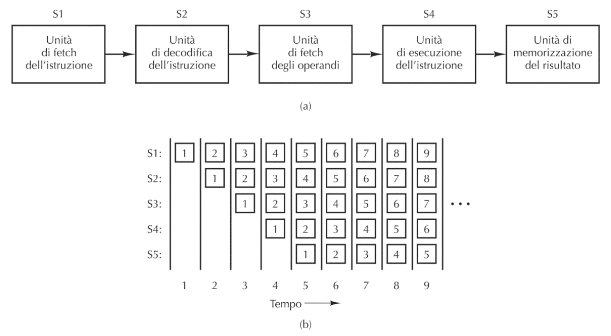
  Esempio di pipelining con un processore diviso in 5 sezioni differenti. Ogni numero corrisponde a una singola operazione, la quale si può trovare sello stadi S1, S2, S3, S4 oppure S5.
- **Multicore**
  All’interno della stessa CPU vengono **replicate CU e ALU** al fine di eseguire operazioni in parallelo.
  
  Processore multicore.
- **Array computer**
  All’interno della stessa CPU vengono **replicate ALU e memorie** al fine di eseguire la stessa operazione in parallelo su dati diversi (Es. modifica di una foto: su ogni pixel deve essere eseguita la stessa operazione). La CU invece viene condivisa.
  **SIMD**: Single Instruction-stream, Multiple Data-stream.
  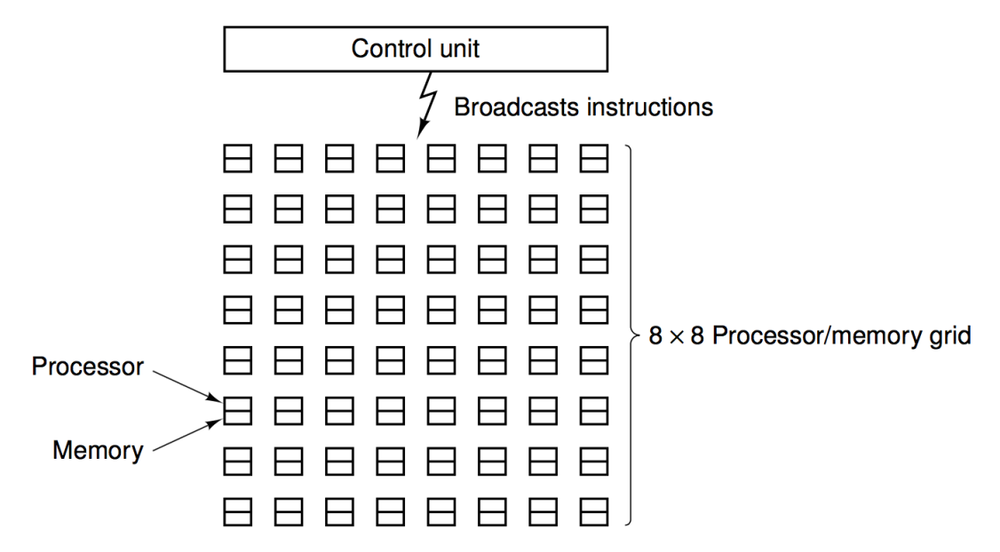
- **Multiprocessori**
  Più CPU condividono la stessa memoria, senza eseguire necessariamente la stessa operazione.
  **MIMD**: Multiple Instruction-stream, Multiple Data-stream.
  
- **Multicomputer**
  Più CPU che non condividono la stessa memoria e che comunicano tramite dei messaggi; rappresenta la forma più estrema di parallelismo.
  

### **Cosa significa processore basato su 32 o 64 bit?**

Questo valore indica quanti bit alla volta vengono letti e scritti dalla CPU nella memoria. Questi blocchi di bit vengono detti word.

- **2.2 - Memorie**
  Le **memorie** sono le componenti di un calcolatore che permettono di memorizzare dati e programmi.
  Le principali memorie possono essere rappresentate graficamente in una piramide, nella quale andando dal basso verso l’alto si incontrano memorie sempre più veloci e più costose a parità di byte memorizzabili.
  
  Le memorie si possono dividere in base alle loro caratteristiche:
- **Volatili**: tengono in memoria i dati finchè l’elaboratore viene alimentato.
- **Persistenti**: l’informazione rimane memorizzata anche quando il calcolatore non è alimentato.
- **On-line**: i dati sono sempre accessibili.
- **Off-line**: i dati sono accessibili solo se la memoria è collegata all’elaboratore (ad esempio i dischi ottici devono essere inseriti nell’apposito lettore per essere letti).

### Organizzazione delle memorie

Le memorie si organizzano in **celle**, le quali sono sequenze di bit (in genere 8) con un loro indirizzo.
I processori però operano solitamente su blocchi di memoria superiori ad 8 (in genere 32 o 64) e chiamati **word**, e questi vengono organizzati in byte seguendo due modalità: **big endian**, con indirizzi asseganti da sinistra verso destra, e **little endian**, con indirizzi assegnati da destra verso sinistra.


### Cache

La **cache** è una memoria molto veloce ma poco capiente. Viene utilizzata per memorizzare le word di memoria utilizzate più di frequente.
Quando la CPU necessita di una word, la cerca prima di tutto nella cache e, se non presente la preleva dalla memoria principale e la inserisce nella cache. Solitamente questo processo di memorizzazione nella cache permette di risparmiare tempo rispetto al semplice prelievo delle word dalla memoria principale, in quanto il tempo medio di accesso viene quantificato con la formula **c+(1-h)m**, dove c è il tempo di accesso alla cache, m il tempo di accesso alla memoria principale e h (valore che va da 0 a 1) la probabilità di trovare l’informazione cercata nella cache. Da questa formula si comprende come più la probabilità di trovare l’informazione nella cache aumenta, più il tempo di accesso equivale a c, mentre con meno probabilità di trovare l’informazioe nella cache il tempo equivale a c+m. Ovviamente la probabilità di trovare l’informazione nella cache dipende dalla sua dimensione e da come viene gestito il passaggio dei dati tra cache e memoria centrale.

### Hard Disk e SSD

Un **Hard Disk** è un dispositivo elettro-magnetico che permette di conservare informazioni sotto forma magnetica. Esso è composto da:

- **Testina**: magnetizza porzioni di disco al fine di memorizzare informazioni e legge lo stato di magnetizzazione della superficie del disco.
- **Traccia**: sequenza circolare di bit.
- **Settore**: porzione di traccia che contiene una quantità prefissata di bit uguale per tutti i settori.
  Una **SSD (Solid State Drive)** invece è un dispositivo completamente elettronico, il quale non presenta nessuna parte in movimento. Sono più veloci degli hard disk ma più costosi.

### RAID

Il **RAID (Redundant Array Of Information Disks)** è una tecnica di memorizzazione che consiste nell’utilizzare più Hard Disk/SSD al fine di avere una velocità di lettura/scrittura maggiore, in quanto le CPU moderne permettono di effettuare più operazioni in parallelo e dunque sono in grado di leggere da più dischi contemporaneamente, e una migliore affidabilità, in quanto permette di memorizzare informazioni riguardo i dati all’interno di altri dischi in modo che se il disco principale viene danneggiato questo può essere recuperato.
Esistono diverse tipologie di RAID, le quali consistono in diverse tecniche di memorizzazione dei dati:

- **RAID 0**
  Consiste nel memorizzare l’informazione suddividendola in più dischi, così che sia la lettura che la scrittura possa essere fatta in parallelo.
- **RAID 1**
  Consiste nel copiare la stessa informazione su più dischi al fine di aumentare la sicurezza e, se il processore è in grado di leggere la stessa informazione da più dischi diversi anche la velocità viene aumentata.
- **RAID 2-3-4-5**
  Tecniche che consistono nell’utilizzare in dischi secondari dei byte che permettono di verificare l’integratezza dei dati e di ricostruire l’informazione nel caso essa venga danneggiata.

### Dischi ottici

I **dischi ottici** sono memorie che utilizzano un principio ottico che consiste nel codificare le informazioni alternando dei fori (**Pit**) a zone piane (**Land**). Il disco viene letto tramite un raggio laser che viene riflesso in modo diverso al passaggio di Pit e Land e se individua un passaggio Pit-Land codifica un 1, altrimenti l’assenza di variazioni codifica uno 0.
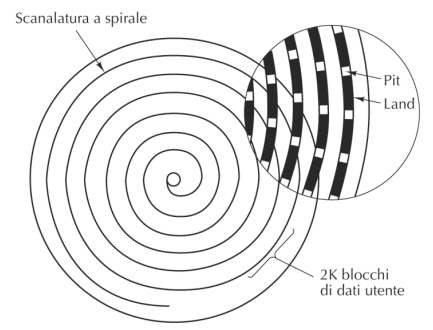
Le tipologie di dischi ottici sono le seguenti:

- **CD-ROM** (Read Only Memory): scritto dal costruttore e non riscrivibile.
- **CD-R** (Read): scrivibile una sola volta.
- **CD-RW** (Read/Write): riscrivibile più volte.
- **DVD** (Digital Video Disk).
- **Blu Ray**: utilizza un laser blu a differenza di quello rosso del DVD, permettendo migliori risoluzioni.
- **2.3 - Dispositivi di input e output**
  I dispositivi di input/output più popolari sono i seguenti:
- **Tastiera**
- **Mouse**
- **Monitor**
  Richiede una specifica scheda video che contiene un proprio processore chiamato **GPU (Graphical Processing Unit)**, solitamente basata su architetture multicore avanzate che sono anche programmabili per eseguire programmi non grafici.
- **Stampanti**
  Un dispositivo di input o output si collega al bus tramite un **controller**, il quale contiene la maggior parte dell’elettronica. Alcuni controller accedono direttamente alla memoria senza passare per la CPU, utilizzando una tecnica chiamata **DMA (Direct Memory Access)**. Al termine della scrittura/lettura si invia un segnale interrupt alla CPU per informare il sistema operativo che l’I/O è terminato. Un chip chiamato **arbitro del bus** stabilisce i turni secondo i quali i dispositivi di input/output e la CPU accedono al bus al fine di evitare collisioni.
- **3.0 - Porte logiche e circuiti combinatori**
  

- **3.1 - Algebra di Boole**
  L’**algebra di Boole** definisce un’aritmetica tra i due valori binari 0 e 1, utilizzati dall’elaboratore.
  Gli operatori base di tale algebra sono 3:
- Addizione ($A+B$ oppure **OR**)
- Moltiplicazione ($A \times B$ oppure **AND**)
- Negazione ($\overline A$ oppure **NOT**)

### Proprietà dell’algebra di Boole


Nota: le leggi di De Morgan valgono anche su più di 2 variabili.
Nota: le leggi da ricordare sono le 2 leggi distributive e le 2 leggi di De Morgan, in quanto le altre si ricavano da queste.

- **3.2 - Tabella di verità e formula canonica**

### Funzione booleana e tabella di verità

Una **funzione booleana** associa a delle variabili booleane in input un valore booleano in output. Esse possono essere descritte in modo completo tramite una tabella di verità, la quale mostra tutte le combinazioni booleane tra le variabili e i rispettivi output.

Esempio di tabella di verità-

### Mintermini e espressioni booleane

- Un **letterale** è una variabile o una variabile negata
- Un **mintermine** su n variabili corrisponde ad un AND logico tra n letterali corrispondenti alle n variabili.
  Ogni combinazione dei valori delle variabili di una funzione ha un solo mintermine che fornisce come risultato 1.
  
  Esempio di mintermini di una funzione che forniscono come risultato 1.
- Ogni funzione booleana può essere descritta tramite una funzione creata con il solo utilizzo degli operatori base (AND, OR e NOT). In particolare esiste una funzione detta **canonica** la quale è molto facile da trovare partendo dalla tabella di verità ma non sempre corrisponde alla forma minima.
  Per costruirla occorre trovare i mintermini della funzione nei casi in cui essa assume valore 1 ed effettuare l’operazione OR tra di loro.
  
  Forma canonica

### Array logico programmabili

Siccome tutte le funzioni booleane si possono definire tramite una forma canonica vista in precedenza, è possibile realizzare ogni tipo di circuito avente n input tramite un **array logico programmabile**, il quale prevede porte AND per tutte le possibili combinazioni degli n input, e una porta OR finale tra gli output di tutti i mintermini.
Questo tipo di circuito consente di realizzare tutte le funzioni booleane con n input in quanto presenta dei fusibili lungo i fili che permettono di decidere se interrompere o meno un collegamento e realizzare qualsiasi funzione canonica.

Esempio di array logico programmabile

- **3.3 - Porte logiche**

### Transistor

Un **transistor** rappresenta un componente elettronico alla base delle architetture di ogni elaboratore in quanto permette di creare porte logiche. Esso è composto da 3 connessioni: **base** (dove viene dato il valore di input), **collettore** e **emettitore** e funziona in questo modo:

- Se non c’è tensione sulla base, si comporta come una resistenza infinita tra collettore e emettitore.
- Se c’è tensione sulla base, si comporta da conduttore ideale tra collettore e emettitore.
  **NOT con transistor**
  
- Se non viene fornita tensione a $V_{in}$ (input = 0), allora la tensione $V_{cc}$ (1) viene trasmessa a $V_{out}$ (output = 1).
- Se viene fornita tensione a $V_{in}$ (input = 0), allora la tensione $V_{cc}$ (1) passa dal collettore all’emettitore e viene trasmessa a terra, e non ci sarà tensione su $V_{out}$ (output = 0).
  **NAND con transistor**
  
- La tensione va a terra (0) solo se a entrambe le basi ($V_1$ e $V_2$) viene data tensione, altrimenti $V_{cc}$ (1) viene trasmessa in output a $V_{out}$.

### Porte logiche

È possibile implementare circuiti tramite l’utilizzo di porte logiche.
In particolare utilizzeremo la porta NAND per rappresentare ogni tipo di circuito per 2 principali motivi:

- Facile da realizzare partendo da transistor.
- La porta logica NAND è universale, dunque tramite essa è possibile realizzare qualsiasi altra porta logica partendo da essa.
  **NOT**
  
  **AND**
  
  **OR**
  

- **3.4 - Mappa di Karnaugh e formula minimale**

  ### Mappa di Karnaugh

  La forma canonica di una funzione è solitamente utile nel caso in cui si voglia utilizzare un PLA, mentre non lo è se si punta all’efficenza di un circuito, in quanto molte volte si riescono ad utilizzare formule con l’ausilio di un numero minore di porte logiche.
  Queste funzioni, dette **minimali**, sono realizzabili tramite la creazione preventiva di una tabella bidimensionale simile alla tabella di verità, chiamata **mappa di Karnaugh**. Essa è realizzabile nel seguente modo:

  1. Creare una tabella bidimensionale il quale numero di righe e colonne è $2^n$, con n il numero di letterali presenti nella riga o nella colonna. Quali letterali vanno inseriti nelle righe e nelle colonne della mappa non ha importanza, basta che il successivo riempimento della mappa con gli 0 e gli 1 venga fatto nella maniera corretta rispettando la tabella di verità.
  2. Scrivere a lato di ogni riga e colonna ogni possibile combinazione dei letterali seguendo il codice gray, il quale permette di realizzare una tabella in cui due celle adiacenti differiscono per un solo letterale.

     **Come realizzare il codice gray?**

     Per ottenere un numero nel codice grey occorre partire dal corrispondente numero binario e fare una XOR bit a bit, ovvero una somma senza riporti, con sè stesso spostato di una cifra a destra.

     Esempio:

     - **6** in decimale → **110** in binario → **101** in gray
       110 + (binario)
       011(0) = (binario spostato a destra)
       101 (gray)

     I primi numeri in codice gray sono dunque i seguenti:

     

     Tabella decimale, binario, gray dei numeri da 0 a 15.

  3. Riempire la tabella inserendo 0 e 1 a seconda delle combinazioni dei letterali
     
     **Come ricavare la formula minimale dalla mappa di Karnaugh?**
     All’interno della mappa di Karnaugh appaiono gruppi adiacenti di 1 formati dagli stessi letterali. Per ricavare la formula minimale occorre individuare questi gruppi rispettando alcune regole:

  - Tutte le celle dei raggruppamenti contengono 1
  - Il numero di celle in un raggruppamento deve essere in potenza di 2 (1, 2, 4 …)
  - I raggruppamenti non devono essere potenzialmente inclusi in raggruppamenti più grandi (altrimenti si otterrebbe una formula corretta ma non minimale)
  - I raggruppamenti possono essere fatti anche continuando oltre la fine della mappa (effetto pacman).
    A questo punto occorre considerare l’OR tra i mintermini costituiti dai letterali che formano il raggruppamento, come nell’esempio:
    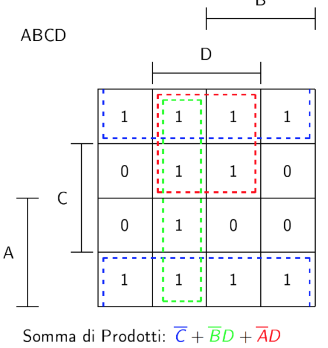

- **4.0 - Rappresentazione dell’informazione**

  - **4.1 - Numeri interi**
    ### Sistemi di numerazione posizionale
    Data una codifica in base b, è possibile rappresentare un numero con tale codifica utilizzando cifre **da 0 a b-1**.
    Sia $d_kd_{k-1}...d_0$ un numero codificato in base b, per avere lo stesso numero convertito in decimale occorre utilizzare la seguente formula $\sum_{i=0...k}d_i*b^{i}$.
    **Codifiche posizionali in informatica**
    In informatica le codifiche posizionali più utilizzate sono il **binario** (base 2), l’**ottale** (base 8) e l’**esadecimale** (base 16), per via del fatto che la conversione di numeri tra queste codifiche è più semplice che con il decimale.
    Ogni cifra in esadecimale corrisponde infatti esattamente a 4 cifre binarie e ogni cifra in ottale corrisponde esattamente a 3 cifre binarie, dunque la conversione avviene nel seguente modo.
    
    **Conversione binario-decimale**
    Per convertire un numero da binario a decimale, oltre all’utilizzo della formula generale per la conversione in decimale, è possibile utilizzare **la tecnica delle moltiplicazioni successive**: partendo dalla cifra più significativa e da un accumulatore uguale a 0, occorre sommare alla cifra del numero in binario il prodotto tra il numero 2 e l’accumulatore, il quale acquisisce il valore del numero più a destra.
    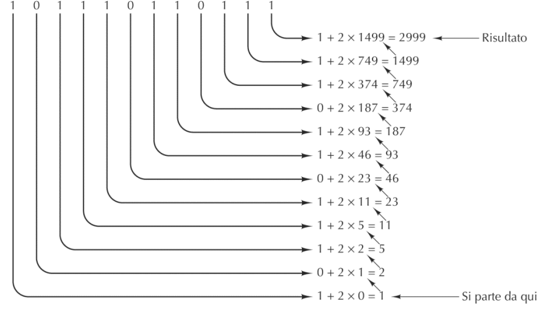
    Per effettuare la conversione da decimale a binario invece è possibile utilizzata la tecnica inversa, la quale consiste nel dividere ripetutamente per 2 il numero decimale e considerando i resti delle divisioni in ordine inverso di generazione.
    ### Codifica di numeri con segno
    Per codificare un **numero con segno** si possono utilizzare diverse tecniche:
    **Modulo e segno**
    Si usa il bit più a sinistra per il segno: **0 = positivo, 1 = negativo**.
    Esempio: 00001101 = 13, 10001101 = -13
    **Complemento a 1**
    Si usa il bit più a sinistra per il segno, ma se il numero è negativo i restanti bit vengono invertiti. A differenza della tecnica con modulo e segno permette di effettuare operazioni aritmetiche in maniera più semplice.
    Esempio: 00001101 = 13, 11110010 = -13
    **Complemento a 2**
    Si usa il bit più a sinistra per il segno ma se il numero è negativo i restanti bit vengono invertiti e aggiunto 1. È il metodo più utilizzato in informatica per rappresentare i numeri con segno. L’aggiunta di un 1 per i numeri negativi permette di rappresentare un numero in più con la stessa quantità di bit rispetto al complemento a 1, in quanto in quest’ultima codifica era possibile rappresentare il numero 0 con due codifiche differenti (00000000 e 11111111).
    Esempio: 00001101 = 13, 11110011 = -13
    Se si considera un numero in complemento a 2 come un numero binario normale, si ottiene un numero positivo che sta in relazione con il corrispondente numero negativo secondo la formula:
    $2^k - m = n$
    - $k$ = numero di bit
    - $m$ = valore del numero binario in complemento a 2
    - $n$ = modulo del numero negativo
      Esempio utilizzando 8 bit:
      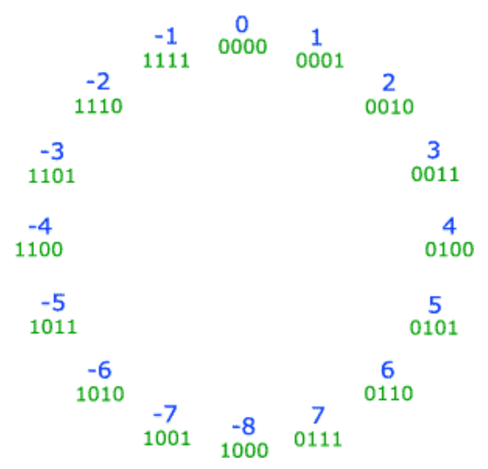
      **Codifica in eccesso**
      Consiste nel sottrarre $2^{k-1}$ o $2^{k-1}-1$ (dipende dalla codifica che viene usata, solitamente si dice codifica in eccesso $n$ per determinare quale numero bisogna sottrarre al valore decimale del numero rappresentato) al numero decimale corrispondente al numero binario per ottenere il numero decimale nella codifica. Questo permette di spostare l’intervallo dei numeri al fine di rappresentare con i numeri negativi con i primi $2^{k-1}$ numeri.
      Esempio: in codifica ad eccesso 128, 00000000 = -128, 10000000 = 0, 11111111 = 127
      **Numeri rappresentabili in base alle codifiche**
    - Numeri naturali non negativi: **[0, $2^k$-1]**
    - Modulo e segno o complemento a 1: **[-$2^{k-1}$+1, $2^{k-1}$-1]**
    - Complemento a 2 o codifica in eccesso: **[-$2^{k-1}$, $2^{k-1}$-1]**
      **Somma in complemento a 1 e 2**
      Le codifiche in complemento a 1 e a 2 vengono utilizzate per la loro efficacia nell’operazione della somma, in quanto in entrambe i casi, sia se i due numeri sono entrambe positivi che se uno dei due è negativo, basta sommare **bit a bit** i due numeri.
      Nel complemento a 1 però, se c’è un riporto questo viene sommato al risultato, mentre nel complemento a 2 il riporto viene scartato.
      Nell’operazione di somma per i numeri a complemento a 1 e a 2 vi è **overflow** solo nel caso in cui i due addendi sono dello stesso segno e il risultato è di segno opposto.
      

- **4.2 - Numeri con la virgola**
  **Perchè il floating point?**
  I numeri con la virgola in informatica non vengono rappresentati nella maniera classica, ovvero a virgola fissa, in quanto questa tecnica spesso non è molto efficace a causa del maggiore consumo di **memoria** e per la **difficoltà nei calcoli**.
  Per questo motivo viene utilizzata la tecnica del **floating point**, la quale consiste nel rappresentare un numero con la virgola utilizzando due interi distinti, la **mantissa** (o **frazione**) e l’**esponente**.
  Esempio:

- Nonostante gli elaboratori lavorino in base 2 facciamo un esempio utilizzando numeri in base 10 al fine di comprendere meglio il concetto.
  Mettiamo caso che venga utilizzata la tecnica classica con virgola fissa, e in uno stesso calcolo vengano utilizzati due numeri, uno molto grande come $300000000$, e l’altro molto piccolo come $0.00000015$.
  Innanzitutto capiamo come la loro **memorizzazione** è molto dispendiosa in quanto occorrerebbe una notazione che tenga conto di almeno 9 cifre a sinistra della virgola e 8 cifre a destra della virgola. Inoltre, molte delle **operazioni** che verranno effettuate tra questi 2 numeri risulteranno complicate, come ad esempio la moltiplicazione la quale prevede di moltiplicare tutte le cifre dei due numeri tra loro e poi di sommare i risultati.
  Per questi motivi è utile rappresentare questi due numeri tramite un’altra tecnica, quella del floating point, la quale ci consentirebbe di rappresentarli nella seguente maniera:
  - $300000000 = 3 \times 10^8$.
  - $0.00000015 = 1.5 \times 10^{-7}$.
    In questo modo si otterranno dei vantaggi sia in termini di memoria, in quanto per ognuno dei due numeri sarà sufficiente memorizzare la mantissa e l’esponente i quali sono molto più piccoli dei numeri dai quali siamo partiti, che in termini di performance, in quanto ad esempio per l’operazione di moltiplicazione basterà moltiplicare le due mantisse e sommare i due esponenti:
    $300000000 \times 0.00000015 = 3 \times 1.5 \times 10^{8-7} = 4.5 \times 10 = 45$.
    La stessa tecnica può essere utilizzata per rappresentare i numeri in base 2 utilizzando come moltiplicatore $2^n$, ad esempio $0.0101 = 0.101 \times 2^{-1}$.
    **Conversione da decimale a binario di numeri con la virgola**
    Prima di rappresentare un numero decimale in notazione floating point al fine di memorizzarlo all’interno di un computer occorre prima **convertirlo in binario**.
    Per fare ciò occorre dividere il numero nella parte intera e quella decimale ed effettuare la conversione in maniera separata:
- Per la **parte intera** la conversione avviene nella maniera classica, ovvero con le successive divisioni per 2 del numero con la considerazione del resto di ogni divisione.
- Per la **parte decimale** la conversione avviene moltiplicando per 2 consecutivamente il numero e togliendo la parte intera del numero ad ogni moltiplicazione fino ad arrivare al numero 0.
  Esempio:
  - _Convertire il numero $28.125_{10}$ in binario._ - Parte intera.
    $28|0\\14|0\\7|1\\3|1\\1|1\\0$
    $28_{10} = 11100\*2$
    - Parte decimale.
      $0.125*2 = 0.250 | 0 \\ 0.250 * 2 = 0.5 | 0 \\ 0.5 * 2 = 1.0 | 1 \\ 0$
      $0.125*{10} = 0.001$
      $28.125_{10} = 11100.001_2$
      **Notazioni floating point**
      Siccome tramite la codifica floating point è possibile rappresentare uno stesso numero in molti modi diversi (es. $30_{10} = ((3 \times 10^1)_{10} = (300 \times 10^{-1})_{10} = (1111 \times 2^1)_2$) esistono diversi standard che definiscono le regole nella rappresentazione dei numeri.
      In genere tutti gli standard che gli elaboratori utilizzano seguono queste regole principali:
- La mantissa e l’esponente vengono rappresentati come interi in **base** 2, 4, 8 o 16.
- Viene utilizzata una mantissa **minore di 1**.
- La mantissa viene solitamente **normalizzata**, ovvero per ottimizzare la memoria utilizzata la cifra più significativa di questa non è mai uguale a 0.
  
  Rappresentazioni floating point del numero 432 in base 2 non normalizzata, base 2 normalizzata, base 16 non normalizzata e base 16 normalizzata.
  **Standard IEEE 754**
  Lo standard **IEEE 754** è il più usato per rappresentare numeri floating point.
  Esso definisce diversi formati tra i quali single (BINARY32) e double (BINARY64) precision. Il **BINARY32** presenta le seguenti caratteristiche:
- **1 bit** per il segno del numero.
- **8 bit** di esponente, il segno viene espresso tramite la notazione in eccesso 127 (bisogna sottrarre 127 al corrispondente numero decimale per conoscere il valore dell’esponente).
- **23 bit** di mantissa. La rappresentazione della mantissa è particolare rispetto agli altri standard in quanto siccome qualunque numero normalizzato ha come prima cifra della mantissa 1 allora questa non ha necessità di essere memorizzata, e dunque quella cifra la si lascia prima della virgola.
  Esempio:
- _Convertire il numero -30.375 in binario utilizzando lo standard floating point IEEE 754_.

  1.  Convertire il numero 30.375 in binario:

      - Parte intera: $30_{(10)} = 11110_{(2)}$.
      - Parte decimale: $0.375_{(10)} = 0.011_{(2)}$.

      Quindi, $30.375_{10} = 11110.011_2$

  2.  Normalizzare il numero binario ottenuto lasciando un 1 prima della virgola:

      $11110.011 = 1.1110011 \times 2^4_{(2)}$.

  3.  Convertire l’esponente in binario utilizzando la notazione in eccesso 127:

      $127 + 4 = 131_{(10)} = 10000011_{(2)}$.

  4.  Inserire l’esponente e la mantissa nelle giuste postazioni ricordando che il bit di segno deve essere 1 per via del fatto che il numero è negativo:

           $-30.375=1|10000011|11100110000000000000000$.

      **Problemi nella rappresentazione floating point**
      Nonostante ci si aspetti che i calcoli di un computer siano estremamente accurati è possibile incorrere in **errori nei risultati** di alcuni calcoli con i numeri con la virgola.
      Questo perchè a differenza di noi umani un computer utilizza solo numeri in base 2, i quali possono presentare la **periodicità** anche quando il corrispondente numero in decimale non la presenta. Ad esempio il numero $0.2$ in decimale equivale a $0.0\overline{0011}$ in binario. Il problema dunque risiede nel fatto che il computer non può memorizzare e lavorare con una quantità di cifre infinite, dunque ha necessità di troncare un numero periodico, e così facendo possono essere riscontrati problemi in alcune operazioni che utilizzano questi tipi di numeri (Es. alcuni compilatori possono fornire come risultato dell’operazione $0.1 + 0.2$ il numero $0.300000\dots1$).

- **4.3 - Caratteri**
  Per rappresentare i caratteri utilizzando dei bit esistono diverse **codifiche** che differiscono per il numero di bit utilizzati e dal loro significato.
  **ASCII**
  La codifica **ASCII (American Standard Code for Information Interchange)** è una codifica largamente diffusa che utilizza **7 bit** per rappresentare i principali simboli alfanumerici anglosassoni e per alcuni caratteri speciali.
  **UNICODE**
  Siccome la codifica ASCII prende in considerazione solamente i caratteri dell’alfabeto anglosassone, esistono altre codifiche, come la UNICODE, che utilizzano una quantità maggiore di bit al fine di tenere conto anche di altri alfabeti.
  La **UNICODE** utilizza infatti **16 bit** con i quali è possibile rappresentare i caratteri di **diversi alfabeti**, i quali caratteri vengono messi in intervalli contigui di codici, ed è anche compatibile con la codifica ASCII in quanto se i primi 9 bit vengono messi a 0 con i restanti 7 bit è possibile rappresentare i caratteri dell’alfabeto anglosassone. Inoltre esistono codici all’interno dell’UNICODE che non sono stati ancora assegnati al fine di poter rappresentare in futuro nuovi caratteri.
  **UTF-8**
  **UTF-8 (Unicode Transformation Format)** è una codifica più ottimizzata rispetto all’UNICODE in quanto può dinamicamente utilizzare **da 1 a 4 byte** a seconda dell’informazione da codificare. I bit iniziali infatti indicano la quantità di bit utilizzati (es. se il bit iniziale è 0, i restanti 7 bit contengono una codifica ASCII).
- **4.4 - Codici correttori**
  Occasionalmente le memorie di un elaboratore possono commettere degli errori in fase di scrittura , lettura o in fase di trasmissione, spesso a causa di picchi di tensione sulle linee di alimentazione. Per proteggersi da questi errori, le memorie utilizzano dei codici di rilevazione e/o correzione degli errori, i quali consistono nell’aggiunta di bit extra alla parola da memorizzare che verranno controllati nel momento in cui il dato verrà letto.
  **Distanza di Hamming di due sequenze**
  La **distanza di Hamming** indica il numero di bit per i quali due sequenze di bit differiscono tra loro, ad esempio i due byte $10010111$ e $10010001$ hanno una distanza di Hamming di 2 bit.
  **Parola di codice**
  Come abbiamo detto in precedenza, per rilevare e/o correggere gli errori in una sequenza di codice occorre aggiungere dei bit di controllo a tale sequenza. Supponiamo dunque di avere una parola di memoria che consiste in **m** bit di dati ai quali vengono aggiunti **r** bit di controllo; si otterrà dunque una sequenza lunga **n = m + r**, la quale viene chiamata **parola di codice**. I bit di controllo aggiuntivi indicano delle proprietà particolari dei bit presenti nella sequenza (es. quantità di bit che hanno valore 1, se i bit che hanno valore 1 sono di quantità pari o dispari ecc.) che permettono, al momento della lettura del dato, di stabilire con più o meno precisione se si sono verificati errori.
  **Distanza di Hamming dell’intero codice**
  I bit di controllo consentono dunque di ottenere un insieme di parole di codice lecite e altre illecite, nelle quali si sono sicuramente verificati degli errori. Conoscendo la modalità che è stata scelta per inserire i bit di controllo all’interno di una sequenza di codice è possibile costruire una lista completa di tutte le parole di codice lecite. Dopo aver ottenuto questa lista occorre trovare le due parole di codice per le quali la distanza di Hamming è minima, e quella sarà la **distanza di Hamming dell’intero codice**.
  **Quanto deve essere la distanza di Hamming dell’intero codice?**
  La precisione nel trovare gli errori all’interno di una parola di codice dipende dunque dalla distanza di Hamming dell’intero codice:
- Per **rilevare d errori singoli** all’interno di una sequenza è necessario un codice con una distanza di Hamming di almeno **d + 1**.
  **Perchè?** Se con un certo tipo di bit di controllo otteniamo una lista di parole lecite che hanno distanza di Hamming minima corrispondente a d + 1, possiamo prendere una qualunque delle parole lecite all’interno della lista e scambiare d bit e otterremo sempre una parola illecita, proprio perchè per raggiungere un’altra parola lecite bisogna scambiare almeno d + 1 bit per via della minima distanza di Hamming.
- Per **correggere d errori singoli** all’interno di una sequenza è necessario un codice con una distanza di Hamming di almeno **2d + 1**.
  **Perchè?** Se con un certo tipo di bit di controllo otteniamo una lista di parole lecite che hanno una distanza di Hamming minima corrispondente a 2d + 1, possiamo prendere una qualunque delle parole lecite all’interno della lista e scambiare d bit e otterremo sempre una parola illecita con una distanza di Hamming minore della metà della distanza di Hamming minime, il che significa che sarà più simile alla parola giusta che ad ogni altra parola sbagliata, permettendone così la correzione.
  Esempio:
- Come semplice esempio utilizziamo un codice con solo quattro parole lecite:
  $0000000000, 0000011111, 1111100000, 1111111111$.
  Questo codice ha una distanza di Hamming equivalente a 5, il che significa che può rilevare al massimo 4 errori e che può correggere 2 errori. Infatti, se arriva la parola di codice 0000000111 il ricevente sa che l’originale doveva essere 0000011111, mentre se un errore triplo modifica per esempio la parola 0000000000 nella parola 0000000111 non possono essere effettuate correzioni.
  **Bit di parità**
  Molti algoritmi di rilevazione e correzione di errori utilizzano **bit di parità**, ossia bit aggiuntivi i quali vengono messi a 0 se la somma dei valori dei bit che controllano è pari, altrimenti a 1. Vengono dunque chiamati bit di parità in quanto la somma del loro valore e dei valori dei bit che controllano è sempre pari.
  **Algoritmo di Hamming**
  L’algoritmo di Hamming stabilisce un metodo per inserire il minor numero di bit di controllo all’interno di una sequenza di codice in modo da correggere tutti gli errori singoli.
  Ciascuna delle $2^m$ parole di memoria legali deve dunque avere $n$ parole di codice illegali a distanza 1 da essa, ognuna corrispondente alla stessa sequenza con 1 bit modificato, ovvero quello in cui può avvenire l’errore. Dunque, siccome ognuna delle $2^m$ parole di memoria lecita richiede $n + 1$ sequenze di codice a essa dedicate ($n$ per l sequenze che con gli errori e 1 per la sequenza lecita), e visto che il maggior numero di sequenze di codice differenti realizzabile con $n$ bit è $2^n$, occorre rispettare la seguente relazione $(n + 1) 2^m \leq 2^n$, ovvero $(m + r + 1) \leq 2^r$, nella creazione dell’algoritmo di Hamming (la disequazione stabilisce il minor numero di bit di controllo necessari per correggere errori singoli).
  Per facilitare la spiegazione numeriamo la sequenza di codice di lunghezza $m + r$ costruita aggiungendo gli $r$ bit di controllo alla sequenza di partenza in questo modo: si incomincia a numerare partendo da sinistra (la cifra più significativa) e iniziando da 1. Tutti i bit la cui posizione è una potenza di 2 (1, 2, 4, 8, 16…) vengono utilizzati per inserire i bit di controllo che sono bit di parità, mentre i restanti bit vengono utilizzati per i dati. Ciascun bit è controllato dai bit di controllo $b_1, b_2, \dots, b_n$ tali che la somma delle loro posizioni è equivalente alla posizione del bit. Ad esempio il bit 5 viene controllato dai bit di controllo 1 e 4 in quanto la loro somma fa 5. Dunque:
- Il bit 1 controlla i bit 1, 3, 5, 7, 9 , 11, 13, 15, 17, 19, 21 ecc.
- il bit 2 controlla i bit 2, 3, 6, 7, 10, 11, 14, 15, 18, 19 ecc.
- il bit 4 controlla i bit 4, 5, 6, 7, 12, 13, 14, 15, 20, 21 ecc.
- il bit 8 controlla i bit 8 , 9, 10, 11, 12, 13, 14, 15 ecc.
  In questo modo per controllare se ci sono dei bit errati basta controllare tutti i bit di controllo: se sono tutti corretti non ci sono stati errori, altrimenti la somma delle posizioni dei bit di controllo errati corrisponde alla posizione del bit errato (nella pratica la posizione ottenuta corrisponde al numero in binario ottenuto mettendo a 1 i bit nelle posizioni dei bit errati).
  Esempi:
- _Trovare la parola di codice corrispondente alla parola 1111000010101110 utilizzando l’algoritmo di Hamming._
  La parola di codice che troveremo sarà della forma: XX1X111X000010X01110 (al posto delle X vanno inseriti i bit di controllo).
  - Bit di controllo 1: $X + 1 + 1 + 1 + 0 + 0 + 1 + 1 + 0 + 1 + 0 = X + 6 \Rightarrow X = 0$
  - Bit di controllo 2: $X + 1 + 1 + 1 + 0 + 0 + 0 + 1 + 1 + 1 = X + 6 \Rightarrow X = 0$
  - Bit di controllo 4: $X + 1 + 1 + 1 + 0 + 1 + 0 + 1 + 1 + 0 = X + 6 \Rightarrow X = 0$
  - Bit di controllo 8: $X + 0 + 0 + 0 + 0 + 1 + 0 + 1 = X + 2 \Rightarrow X = 0$
  - Bit di controllo 16: $X + 0 + 1 + 1 + 1 + 0 = X + 3 \Rightarrow X = 1$
    Sostituendo dunque i valori trovati ai bit di controllo corrispondenti troviamo la seguente parola di codice: 00101110000010101110.
- _Correggere la parola di codice 001001100000101101110 costruita tramite l’algoritmo di Hamming._
  Occorre controllare se ci sono bit di controllo errati e nel caso sapere quali:

  - Bit di controllo 1: $0 + 1 + 0 + 1 + 0 + 0 + 1 + 1 + 0 + 1 + 0 = 5 \Rightarrow$ Non corretto.
  - Bit di controllo 2: $0 + 1 + 1 + 1 + 0 + 0 + 0 + 1 + 1 + 1 = 6 \Rightarrow$ Corretto.
  - Bit di controllo 4: $0 + 0 + 1 + 1 + 0 + 1 + 0 + 1 + 1 + 0 = 5 \Rightarrow$ Non corretto.
  - Bit di controllo 8: $0 + 0 + 0 + 0 + 0 + 1 + 0 + 1 = 2 \Rightarrow$ Corretto.
  - Bit di controllo 16: $1 + 0 + 1 + 1 + 1 + 0 = 4 \Rightarrow$ Corretto.
    I bit non corretti sono dunque l’1 e il 4, in quanto la somma dei valori dei bit da loro controllati è dispari. A questo punto è possibile calcolare la posizione del bit errato sommando la posizione dei bit di controllo errati: $1 + 4 = 5$.
    La parola di codice corretta è dunque: 001011100000101101110 .

- **5.0 - Circuiti sequenziali**
  Un circuito sequenziale è un circuito i cui valori di output non dipendono solo dai valori attualmente in input, come per i circuiti combinatori, ma anche da quelli degli input precedenti. È dunque tramite questa proprietà dai circuiti sequenziali che è possibile realizzare delle memorie.
  - **5.1 - Latch**
    ### Latch SR
    Il **latch SR** è uno dei circuiti sequenziali più utilizzati. Esso permette di creare una memoria a 1 bit, ed è realizzato nel seguente modo:
    
    Si nota immediatamente come ciascun output generato dai due circuiti NOR vengono riutilizzati come input nell’altra porta NOR del circuito. Analizziamo dunque le **4 combinazioni** dei due input S e R, tenendo in mente la tabella di verità della porta NOR:
    - **S = 0, R = 1**
      La porta NOR con input R restituisce come output $Q = 0$, visto che uno dei due valori in input è 1. Questo output viene poi riutilizzato come input nell’altra porta NOR, quella con input S, restituendo dunque come output $\overline Q = 1$, visto che i due input valgono 0.
      Tenendo conto dell’output Q, osserviamo che questo viene messo a 0 se l’input proveniente da R è 1, dunque chiamiamo questo caso il caso di **reset**.
    - **S = 1, R = 0**
      La porta NOR con input S restituisce come output $\overline Q = 0$, visto che uno dei due input ha valore 1. Questo output viene poi riutilizzato come input dell’altra porta NOR, quella con input R, restituendo dunque come output $Q = 1$, visto che i due input hanno valore 0.
      Tenendo conto dell’output Q, osserviamo che questo viene messo a 1 se l’input proveniente da S è 1, dunque chiamiamo questo caso il caso di **set**.
    - **S = 0, R = 0**
      Questo caso è diverso dai due precedenti, ed è la causa per la quale questo è un circuito sequenziale. Se ragioniamo infatti come abbiamo fatto per i due casi precedenti notiamo come i due valori in output non si possono conoscere sapendo soltanto i due valori in input, in quanto gli output delle due porte NOR non dipendono dai due input S e R, entrambi aventi valore 0.
      Bisogna in questo caso prendere in considerazione lo stato precedente del circuito, ovvero considerare i due valori in output $Q$ e $\overline Q$. Visto che uno è il contrario dell’altro si formano due casi:
      - **Q = 0**
        Il valore di Q = 0 viene utilizzato come input della porta NOR con input S, restituendo come output il valore $\overline Q = 1$. D’altra parte, il valore in output proveniente dall’altra porta NOR con input R sarà ancora $Q = 0$, in quanto uno dei due valori in input è 1.
        Notiamo dunque che i due valori in output rimangono gli stessi dello stato precedente e non vengono modificati.
      - **Q = 1**
        Il valore di Q = 1 viene utilizzato come input della porta NOR con input S, restituendo come output il valore $\overline Q = 0$. D’altra parte, il valore in output proveniente dall’altra porta NOR con input R sarà ancora $Q = 1$, in quanto entrambi gli input hanno valore 0.
        Anche in questo caso dunque i due valori in output rimangono i medesimi dello stato precedente e non vengono modificati.
        In conclusione possiamo notare che in questo caso i valori in output non dipendono da quelli in input, ma dagli output dello stato precedente del circuito, i quali in tutti i casi non vengono modificati. Chiamiamo quindi questo caso lo **stato di memorizzazione**.
    - **S = 1, R = 1**
      Quest’ultimo caso invece non viene preso in considerazione in quanto forma delle **contraddizioni**:
      - Considerando che S = 1 equivale a fornire il comando set al circuito e che R = 1 equivale al comando reset, non ha senso utilizzare questi due comandi contemporaneamente, in quanto ognuno di essi dovrebbe fornire un valore differente per l’output Q.
      - Inoltre, nel caso in cui si passi dallo stato avente input S = 1, R = 1 allo stato S = 0, R = 0, non si saprebbe che valori inviare in output, in quanto siccome nel primo stato il circuito fornisce in output due 0, quando si passa al secondo stato le due porte hanno entrambe input 0 - 0, il che dovrebbe dare in output il valore 1 che dovrebbe poi essere passato in input all’altra porta causando un output di 0. I valori in output dunque dipendono da quale delle due porte fornisce per prima il valore in output, portando ad una situazione non ben definita.
        Questi due valori in input non vengono dunque mai forniti a questo tipo di circuito.
        In seguito a questo considerazioni possiamo formare la tabella di verità:
        $\begin{array}{| c | c | c | c | c  |}\hline { S } & { R } & { Q_{t} } & {\overline Q_{t}} & State \\\hline 0 & 0 & Q_{t-1} & \overline Q_{t-1} & memory \\\hline 0 & 1 & 0 & 1 & reset \\\hline 1 & 0 & 1 & 0 & set \\\hline 1 & 1 & & & undefined \\\hline
        \end{array}$
        A questo punto può sorgere una domanda: non è possibile creare una memoria utilizzando una semplice porta logica il quale output viene connesso al suo stesso input al fine di memorizzare un certo dato? Sì, è possibile, ma in questo caso occorrerebbe continuare ad alimentare il circuito al fine di mantenere il dato in memoria, mentre tramite l’utilizzo di un Latch SR è possibile continuare a memorizzare il dato anche dopo aver scollegato il circuito dall’alimentazione, anche se durante questo periodo non sarà possibile modificare il dato in memoria.
    ### Latch SR temporizzato
    Spesso è preferibile impedire che il Latch cambi di stato se non in specifici momenti, in quanto per esempio alcune operazioni di addizione ad n bit possono non essere terminate e, se non ne viene impedita la memorizzazione vengono passati in memoria dati non esatti.
    Per questo motivo il circuito viene ampliato con l’utilizzo di un **clock**, ovvero un segnale 0/1 che, implementato con delle porte AND al latch consente di bloccare o far passare i due valori S e R in input. Nel caso in cui i due valori vengono bloccati infatti si fornirebbe in input al circuito due valori 0 - 0, tenendolo in stato di memoria.
    Questo comportamento è detto **commutazione a livello**, ovvero che il livello 1 del clock permette il cambio di stato.
    
    Grafico del segnale di Clock e implementazione del clock nel Latch SR.
    ### Latch D temporizzato
    Per essere sicuri che la situazione **S = 1**, **R = 1** non si verifichi mai viene solitamente utilizzato il circuito **latch D temporizzato**, il quale ha un solo input che viene passato ad S e negato per R. In questo modo i due input S e R sono sempre uno la negazione dell’altro, mentre per la situazione 0 - 0 vengono utilizzati i due AND del clock, i quali bloccano l’input.
    
    Latch D temporizzato.
  - **5.2 - Flip-Flop**
    ### Data Flip-Flop
    In molti circuiti è necessario memorizzare il valore di un particolare istante di tempo, dunque il tempo in cui il clock permette di rilevare nuove informazioni è molto minore rispetto a quello in cui il circuito memorizza l’informazione.
    Per fare ciò si utilizzano circuiti con **commutazione sul fronte**, nei quali il cambio di stato avviene negli istanti in cui il segnale proveniente dal clock è in discesa (1 → 0) o in salita (0 → 1). A differenza del Flip-Flop i Latch temporizzati utilizzavano una **commutazione a livello**, la quale permette un cambio di stato nel momento in cui il segnale proveniente dal clock è 1.
    Per fare in modo che il clock restituisca valore 1 solo in fase di salita si utilizza il seguente circuito, avente in input il segnale di clock:
    
    In questo modo, siccome un segnale che passa attraverso una porta logica impiega più tempo a propagarsi nel circuito, vi sarà un istante specifico, quando il segnale di clock cambia dal valore 0 al valore 1, in cui la porta AND finale restituisce valore 1, in quanto i due segnali in ingresso sono entrambi 1 per via del fatto che il segnale non è ancora stato negato nella porta NOT.
    Notiamo infatti dal grafico a destra questo fenomeno: **a** rappresenta il segnale di clock, **b** rappresenta il segnale di clock negato, il quale ha uno sfasamento per via del passaggio nella porta NOT, **c** rappresenta il segnale nel circuito che va in input alla porta AND, il quale anche lui ha un piccolo sfasamento rispetto al segnale di clock, ma è irrilevante rispetto allo sfasamento creato dalla porta NOT. Il segnale di output **d** infine rappresenta lo stesso dell’AND tra b e c sfasato del ritardo con cui la porta AND propaga il segnale nel circuito, dunque notiamo come l’impulso generato dalla variazione del segnale di clock arrivi al latch un pò in ritardo. Occorre inoltre sottolineare il fatto che il vantaggio dell’architettura flip-flop è di essere di facile comprensione, ma nella realtà vengono spesso utilizzate architetture più complesse.
    Esistono diversi tipi di flip-flop, noi considereremo il flip-flop di tipo D, il quale viene implementato nel seguente modo:
    
    
    Il triangolo in basso indica che si tratta di un circuito temporizzato.
  - **5.3 - Registri e memorie**
    ### 1 bit register
    Abbiamo visto come il DFF permette di mantenere l’input dato nella fase di salita del clock fino alla prossima salita. Il problema a questo punto, nel caso in cui si voglia creare una memoria, consiste nel fatto che alla prossima salita del clock il DFF restituirà in output i nuovi valori dati in input, dunque ad ogni clock il valore memorizzato cambierà.
    Per ovviare a questo problema e costruire dunque una **memoria a 1 bit** occorre utilizzare il DFF assieme ad un circuito combinatorio costituito da un multiplexer, il quale a seconda del valore del selettore decide se continuare a memorizzare il vecchio output oppure iniziare a memorizzare un nuovo input.
    
    1 bit register.
    ### Multi-bit register
    Il **multi-bit register** consente di creare una memoria con un singolo blocco di w bit al suo interno. L’idea è di utilizzare un 1 bit register per ognuno degli w bit del bus in input e collegare ognuno degli 1 bit register al medesimo load.
    
    Multi-bit register.
    ### Counter
    Il **counter** è un altro circuito sequenziale largamente usato per realizzare il **Program Counter (PC)** che indica la locazione di memoria da cui prelevare la prossima istruzione da eseguire.
    Funziona come un registro con l’unica differenza che presenta due ulteriori bit di input: **inc** e **reset.** Il primo, se attivo, comanda al counter di incrementare di 1 bit il suo valore, al fine di passare alla prossima istruzione, mentre il secondo, se attivo, azzera il counter.
    
    Program Counter (PC).
    ### Memoria
    Una **memoria** con n locazioni da w bit può essere realizzata da n multi-bit register controllati da un Direct Access Logic, ovvero un circuito che gestisce la memoria indicando quale dei registri al suo interno deve essere letto o scritto nel caso in cui load è attivo.
    
    Memoria con n locazioni.
    Solitamente torna utile inserire un ulteriore circuito combinatorio dopo le uscite dei singoli registri al fine di decidere quale di questi portare in output.
    In generale, come abbiamo visto, un circuito sequenziale può possedere o meno circuiti combinatori prima o dopo i flip-flop.
    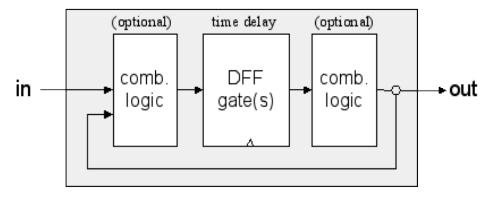
    Struttura generica di un circuito sequenziale.
- **6.0 - Microarchitettura**
  Il **livello di microarchitettura** fa da ponte per i livelli logico digitale e ISA, in quanto utilizza i componenti del primo livello per realizzare le componenti utilizzabili fornendo in input alla macchina istruzioni ISA, definendo anche come queste devono essere composte per far funzionare la macchina in modo corretto.
  Nonostante oggi esistano microarchitetture molto sofisticate noi inizieremo con l’analizzarne una molto semplice, ovvero quella del **processore Hack**, per poi passare ad introdurre aspetti tipici degli elaboratori più complessi, come la **cache**, il **pre-fetch** delle istruzioni e la **pipeline**.
  - **6.1 - Microarchitettura del processore Hack**
    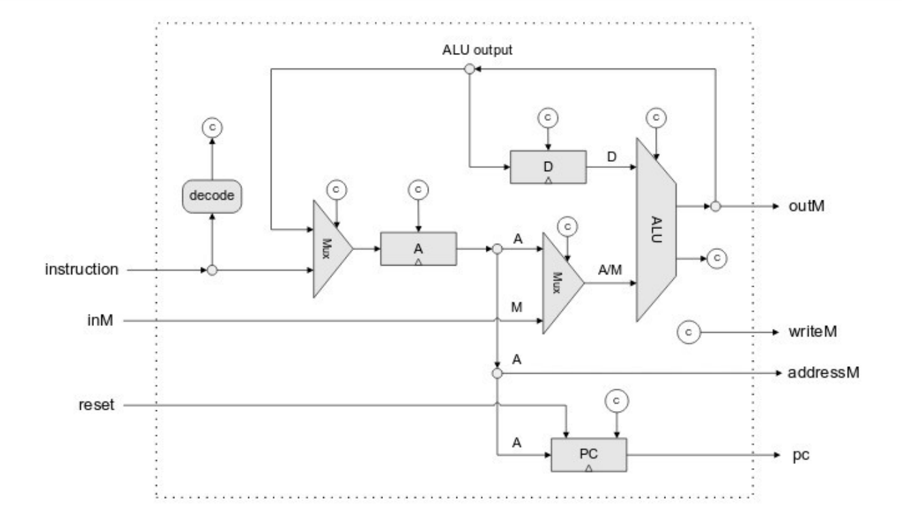
    Microarchitettura del processore Hack.
    Come è possibile vedere dalla figura il processore del computer Hack prende in input un’**istruzione** derivante dalla ROM ed utilizza i suoi bit come **bit di controllo** (i simboli c in figura rappresentano dei bit dell’istruzione). Il processore è composto dalla **ALU**, **3 registri (A, D e PC)** e altre componenti di base che ne consentono il giusto funzionamento.
    Seguendo la figura abbiamo che:
    - Nel **registro A** può essere memorizzato un dato contenuto nell’istruzione oppure l’output della ALU.
    - Nel **registro D** può essere memorizzato solo l’output proveniente dalla ALU.
    - Nel **registro PC** può essere memorizzato il contenuto del registro A oppure l’input reset gli può comandare di essere rispristinato a 0.
    - La **ALU** prende come primo input il contenuto del registro D e come secondo input uno tra il contenuto del registro A e un dato proveniente dalla memoria.
      L’intero **ciclo Fetch-Decode-Execute** del processore Hack viene eseguito completamente durante un **singolo ciclo di clock**, dunque un’istruzione in ingresso al tempo t viene completamente eseguita prima del tempo t + 1, nel quale verrà eseguita l’operazione successiva.
    ### ALU
    
    ALU del computer Hack.
    La **ALU (Arithmetic and Logic Unit)** del computer Hack è un componente interno della CPU che esegue operazioni su due parole in input da **16 bit** e restituisce un risultato in output a **16 bit**.
    L’operazione da svolgere di volta in volta viene identificata dai **bit di controllo**, ovvero 6 bit in input ognuno dei quali indica una diversa operazione da fare:
    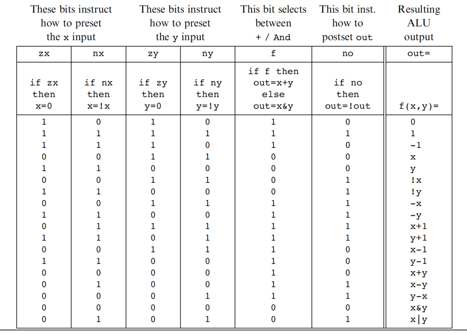
    Uso dei control bit per identificare l’operazione da svolgere.
    Oltre al risultato a 16 bit, la ALU del computer Hack presenta altri due bit di output, **zr** e **ng**, i quali vengono messi a 1 rispettivamente se il risultato è uguale a 0 o se il risultato è negativo. Questo serve per agevolare le operazioni di salto, le quali controllano se il risultato è 0, se è positivo/negativo, o una combinazione delle due cose.
    Come notiamo tra le operazioni che la ALU è in grado di effettuare troviamo operazioni di complemento bit a bit, realizzabili tramite porte not, and bit a bit e or bit a bit. Le uniche operazioni che non siamo in grado di effettuare in questo momento tramite delle porte logiche sono le operazioni di somma e sottrazione, le quali possono però essere implementate tramite l’utilizzo di un adder.
    **Adder**
    
    Adder del computer Hack.
    L’**adder** del computer Hack è un circuito progettato per **sommare due interi a 16 bit**. Esso viene implementato utilizzando **un half adder** e **15 full adder**.
    L’**half adder**, il quale svolge la somma tra 2 bit, viene implementato a sua volta utilizzando una porta xor per il **risultato della somma** e una porta and per il **riporto**.
    
    Half adder del computer Hack.
    Il **full adder** invece svolge la somma tra 3 bit e viene implementato utilizzando 2 Half Adder che svolgono la somma tra i 3 bit e una porta or che controlla se in una delle due operazioni di somma c’è stato almeno un riporto.
    
    Full Adder del computer Hack.
    Il risultato dell’unione di half adder e full adder nell’adder del computer Hack è quello di una classica somma tra due interi come la seguente.
    
    Inoltre nel computer Hack necessitiamo di un unico circuito per effettuare sia la somma che la sottrazione in quanto i due numeri forniti in input alla ALU sono sempre in **complemento a 2**, e come abbiamo visto in precedenza la sottrazione tra due numeri in complemento a 2 si effettua facendo la somma bit a bit.
  - **6.2 - Organizzazione delle memorie**
    ### Gerarchia delle memorie
    Finora abbiamo visto solo memorie realizzate utilizzando flip-flop, le quali sono le più veloci ma anche le più costose. Non è dunque possibile realizzare un’intera memoria con tale tecnologia, per via dei costi e delle dimensioni, per questo la memoria all’interno di un’elaboratore viene organizzata seguendo una gerarchia (dalla più veloce e più costosa alla meno veloce e meno costosa):
    1. **SRAM (Static)**, usate per la cache e per i registri.
    2. **DRAM (Dynamic)**, usate per la memoria centrale.
    3. **Dischi**, usate come memorie secondarie.
       Siccome i vari livelli di memoria devono comunicare tra loro si utilizzano sofisticati algoritmi di caching e paginazione per il passaggio dei dati.
    ### SRAM e DRAM
    Mentre la realizzazione delle **SRAM** l’abbiamo vista in precedenza nella sezione “Circuiti sequenziali”, le **DRAM**, usate per realizzare le memorie centrali, sono composte da **un solo transistor** e un **condensatore** che mantiene, tramite carica elettrica, un singolo bit. Per questo motivo, visto che il condensatore perde la sua carica, deve essere frequentemente ricaricato per evitare di perdere la propria informazione. Vengono dunque svolte periodiche fasi di **refresh**, ad intervalli dell’ordine del millisecondo, e questo causa una maggiore **lentezza** rispetto alle SRAM. Nonostante ciò, per via del fatto che sono costituite da un solo transistor, **costano meno** e sono più piccole.
    **Cache**
    Le **memorie cache**, utilizzare per aumentare la velocità di accesso alle informazioni in memoria, sono organizzate in modo sofisticato. Esistono diverse tipologie di cache, riportiamo un esempio di **cache a 3 livelli** largamente utilizzato:
    1. **Cache di primo livello**: direttamente nel chip della CPU separata fra istruzioni e dati (tra i 16 e i 64 KB).
    2. **Cache di secondo livello**: nello stesso involucro della CPU unificata alle istruzioni e dati (tra 512 KB e 1 MB).
    3. **Cache di terzo livello**: esterna alla CPU (alcuni MB).
       
       Ogni memoria cache lavora seguendo due principi, i quali la rendono utile ed efficace:
    - **Località temporale**
      Indica l’alta probabilità che una **stessa cella** venga acceduta più volte a breve distanza di tempo. Per questo motivo mantenendo in cache una cella acceduta di recente aumenta la probabilità che nelle prossime operazioni sia necessario riaccedere alla medesima cella senza dover passare per la memoria centrale.
      Ad esempio ritroviamo la località temporale quando si lavora con degli stack (last-in-first-out) o con dei loop.
    - **Località spaziale**
      Indica l’alta probabilità che **celle di memoria vicine** vengano accedute a breve distanza di tempo. Per questo motivo mantenendo in cache blocchi contigui di celle aumenta la probabilità che nelle prossime operazioni vengano accedute altre celle che si trovano già in cache, senza dover passare per la memoria centrale.
      Ad esempio ritroviamo la località spaziale quando si attua un’esecuzione sequenziale delle istruzioni o un accesso sequenziale ad un array.
      A livello di microarchitettura si definisce il modo di organizzare la cache. Esistono infatti diverse modalità di gestione di una cache, noi vedremo come esempio la **direct mapped cache** (cache a corrispondenza diretta).
      Si divide la memoria centrale in blocchi di memoria di dimensione **m**. La cache è invece organizzata in un numero **n** di linee di cache di dimensione m. I blocchi in memoria centrale di dimensione m possono dunque essere inseriti in cache utilizzando uno schema detto **“ad orologio”**, ovvero il **k**-esimo blocco in memoria centrale viene inserito nella linea di cache con indice **k % n**. In questo modo, ad ogni accesso in memoria, in base all’indirizzo della cella di memoria, si capisce in quale linea di cache cercarlo.
      Esempio:
    - Prendiamo come esempio una direct mapped cache con 2048 linee (n) di dimensione 32 byte (m).
      
      Direct mapped cache con 2048 linee di dimensione 32 byte.
      Ogni linea della cache presenta i seguenti dati:
      - **Valid**: indica se la linea di cache contiene un blocco.
      - **Tag**: indica quale linea di cache è contenuta.
      - **Data**: indica il contenuto di 32 byte del blocco.
        Avendo indirizzi con un certo numero di bit per indirizzare celle della memoria centrale occorre prendere un numero di bit meno significativi al fine di poter prendere il giusto byte dentro data. Il successivo numero di bit viene preso al fine di indicare la giusta linea di cache nella quale andare a cercare. Il restante numero di bit, quelli più significativi, viene utilizzato per controllare se coincidono con il contenuto del tag della linea in questione; se il tag non è uguale o valid è falso occorre andare a cercare in memoria centrale.
        Un esempio con indirizzi a 32 bit è il seguente:
      - I primi **5 bit meno significativi** vengono utilizzati per prendere il giusto byte nel contenuto di data, poichè $2^{5} = 32$.
      - I **successivi 11 bit** vengono utilizzati per capire quale linea della cache utilizzare, poichè $2^{11} = 2048$.
      - I **restanti 16 bit** più significativi vengono utilizzati per verificare, sempre se valid è vero, che siano uguali a quelli del contenuto di tag.
        
        Quando un certo dato viene trovato in cache si dice che è avvenuta una **cache hit**, mentre quando la ricerca non è avvenuta con successo si dice che è avvenuta una **cache miss**, e in questi casi occorre cercare il blocco di memoria in memoria centrale e riportarlo nella cache per futuri accessi. Prima di inserirlo nella cache, però, bisogna portare il vecchio contenuto della cache presente nella locazione in interesse e riportarlo in memoria centrale, aggiornando così il vecchio dato presente in memoria centrale. Per questo ci sono dei momenti, ovvero da quando un blocco viene inserito in cache fino a quando viene riportato in memoria centrale, in cui i dati della memoria centrale e della cache **non coincidono**. Questo può dunque creare dei problemi nel momento in cui più processori o più dispositivi accedono alla memoria centrale, problemi che devono essere gestiti ad esempio vietando l’accesso in memoria centrale per i blocchi inseriti all’interno della cache.
    ### DRAM e dischi
    Anche **tra memoria centrale e memoria di massa** esistono politiche di gestione simili a quelle tra la memoria cache e la memoria centrale.
    Solitamente viene infatti utilizzata la tecnica della **paginazione**, la quale è gestita dal gestita dal sistema operativo e consiste nello spostamento di interi blocchi di memoria, chiamati pagine, dalla memoria di massa alla memoria centrale nel momento in cui vi è necessità e vengono poi reinseriti in memoria di massa quando tali dati non servono più. Tratteremo nel dettaglio la paginazione in seguito nella sezione “sistemi operativi”.
  - **6.3 - Microarchitetture moderne, prefetch e pipeline**
    ### Prefetch e pipeline
    Finora abbiamo analizzato solo la microarchitettura del processore Hack, la quale però è molto semplificata rispetto alle microarchitetture in commercio. Una tra le più grandi semplificazioni che troviamo è il fatto che la memoria dati e quella delle istruzioni sono separate, ma spesso ciò non avviene, in quanto i programmi da eseguire risiedono solitamente nella **stessa memoria** in cui troviamo i dati da prendere per una corretta esecuzione del programma.
    Il problema dunque risiede nel fatto che caricare le istruzioni dalla memoria e poi i dati necessari per eseguire le istruzioni sempre dalla stessa memoria richiederebbe un **ciclo di clock molto lungo**. Per questo motivo spesso viene utilizzato un hardware dedicato, chiamato **IFU (Instruction Fetch Unit)**, al fine di pre-caricare la prossima istruzione nel frattempo che la precedente è in esecuzione. In questo modo durante l’esecuzione di un programma troviamo all’interno del processore l’elaborazione di due istruzioni, una nel primo stadio, quello di pre-fetch, e l’altra nel secondo stadio, quello di decodifica ed esecuzione.
    Quello che abbiamo appena visto è un esempio molto basilare di **pipeline**, ma nella realtà esistono molte pipeline più complesse, ad esempio la seguente a 7 stadi:
    
    Esempio di pipeline a 7 stadi.
    **Salti durante l’esecuzione in pipeline**
    Un problema che può presentarsi durante l’esecuzione in pipeline riguarda però i **salti** che possono presentarsi durante l’esecuzione di un programma, ad esempio durante l’esecuzione di un ciclo o di un if. In questi casi, se durante l’esecuzione di una certa istruzione ci accorgiamo che questa comanda di effettuare un salto, occorre scartare le istruzioni che non ci servono negli stadi precedenti della pipeline.
    Per ovviare a questo problema, le architetture moderne usano meccanismi sofisticati per cercare di predire i salti già dai primi stadi:
    - Per i **salti incondizionati**, si riescono ad intercettare in fase di decode, la quale si trova solitamente allo stadio 2 della pipeline, e per questo motivo è buona norma inserire una istruzione nulla (nop: no operation) dopo i salti incondizionati per evitare di fare lavoro a vuoto.
    - Per i **salti condizionati** si utilizzano **euristiche**, utilizzando dunque principi statistici:
      - I **salti all’indietro**, utilizzati per i cicli, vengono eseguiti più spesso rispetto a salti in avanti.
      - Se un’istruzione ha causato un salto nelle **scorse esecuzioni**, è più probabile che salti anche la prossima, ed è più probabile che non salti nel caso in cui nelle scorse esecuzioni non ha saltato.
        **Accesso concorrente ai registri in pipeline**
        Un altro problema che può presentarsi durante l’esecuzione in pipeline di un programma riguarda gli **accessi concorrenti ai registri**, ovvero il fatto che diverse istruzioni che si trovano in stadi diversi della pipeline accedano agli stessi registri. In questi casi occorre fare attenzione a decidere in quale ordine eseguire tali operazioni, in quanto ad esempio un’istruzione ad uno stadio precedente può star leggendo dallo stesso registro che un’istruzione ad uno stadio successivo sta modificando. In questi casi l’istruzione allo stadio precedente deve aspettare, mentre in alcuni casi vengono utilizzate delle tecniche di riordino delle istruzioni per limitare queste situazioni.
    ### Microarchitetture morderne
    In questa sezione abbiamo visto molte delle tecnologie avanzate che vengono utilizzate all’interno di molti dei processori di ultima generazione, come gli Intel Core i7.
    Vediamo degli schemi semplificati della sua microarchitettura:
    
    Microarchitettura dell’Intel Core i7.
    
    Percorso dati dell’Intel Core i7 (vista semplificata).
    La microarchitettura appena presentata si replica poi per i vari core presenti all’interno del processore:
    
    Struttura del microprocessore Intel Core i7-3960X.
- **7.0 - Livello ISA (Instruction Set Architecture)**
  Il **livello ISA** di un computer rappresenta l’interfaccia tra hardware e software di un computer, in quanto definisce la sintassi dell’insieme delle istruzioni (Instruction Set) da poter essere eseguite dall’architettura del computer e come queste vengono effettivamente eseguite. Solitamente i compilatori traducono in istruzioni di livello ISA i programmi scritti in linguaggi di più alto livello.

- **7.1 - IS (Instruction Set) del computer Hack**
  Per quanto riguarda l’Instruction Set del computer Hack esistono 3 tipologie di istruzioni:

- **A-instruction**
  Istruzione che inizia con il carattere ‘**@**’ e indica la locazione di memoria da inserire all’interno del **registro A**.
  ```nasm
  @[value]
  ```
  Al posto di **[value]** può essere inserito direttamente l’**indirizzo di memoria**, rappresentato da un numero non negativo, oppure un simbolo, che può essere di 2 tipologie:
  - **Etichetta**: utilizzata per fare riferimento ad un indirizzo della ROM utilizzato per fare dei jump (la sua dichiarazione viene trattata in seguito).
  - **Variabile**: utilizzata per fare riferimento ad un indirizzo della RAM. Esistono variabili **pre-definite** le quali fanno riferimento ad indirizzi precisi:
    - **Registri virtuali**: i simboli **R0, …, R15** sono predefiniti e fanno riferimento agli indirizzi di memoria RAM 0, …, 15.
    - **Puntatori per I/O**: i simboli **SCREEN** e **KBD** che fanno riferimento rispettivamente agli indirizzi 16384 (inizio della memoria per gestire lo schermo) e 24576 (locazione dove viene inserito il codice di un eventuale tasto premuto sulla tastiera) della RAM.
    - **Puntatori di controllo della Virtual Machine**: i simboli **SP**, **LCL**, **ARG**, **THIS**, e **THAT** che fanno riferimento rispettivamente agli indirizzi **RAM 0**, **1**, **2**, **3**, **4**, utili per il funzionamento della Virtual Machine.
      Oltre alle variabili pre-definite è possibile definirne altre inserendo al posto di [value] il nome della variabile da utilizzare (secondo la convenzione le variabili vanno definite in minuscolo), la quale assumerà un valore partendo da 16 in poi in base a quante variabili già sono state definite (la prima assumerà il valore 16, la seconda 17…).
      I simboli inoltre possono essere costituiti da lettere minuscole, maiuscole, cifre decimali (il primo carattere non può essere una cifra decimale) e simboli particolari.
- **C-instruction**
  Istruzione che indica un’operazione da far **eseguire alla ALU** e inserire opzionalmente all’interno di un registro o della memoria RAM. Presenta il seguente schema:
  ```nasm
  [dest] = [comp];[jmp]
  ```
  **[dest]** rappresenta la **destinazione** della computazione, ovvero dove l’ouput di quest’ultima deve essere memorizzato. Dunque [dest] può assumere i seguenti valori: **D** (registro D), **A** (registro A) e **M** (cella di memoria indirizzata dal registro A) o combinazioni di questi 3.
  **[comp]** indica la **computazione** da eseguire attraverso al ALU. Le computazioni che possono essere eseguite sono le seguenti: 0 (false, perchè tutti i bit a 0), 1, -1 (true, perchè tutti i bit a 1), D, A, !D, !A, -D, -A, D+1, A+1, D-1, A-1, D+A, D-A, A-D, D&A, D|A, M, !M, -M, M+1, M-1, D+M, D-M, M-D, D&M, D|M.
  **[jmp]** indica la **condizione** che il risultato di comp deve rispettare al fine di effettuare un **jump**, ovvero un salto nel programma alla riga indicata dal valore memorizzato dall’indirizzo A. **[jmp]** può dunque assumere i seguenti valori: JGT, JEQ , JGE, JLT, JNE, JLE, JMP. Tutte queste condizioni si riferiscono al valore 0, ad esempio JGT effettua il jump solo se il valore uscito dalla ALU è maggiore di 0.
  Sia la parte **[dest]** che quella **[jmp]** dell’istruzione sono **opzionali**, mentre la **[comp]** è **obbligatoria**.
- **Dichiarazione di etichette**
  Le etichette vengono definite tramite la direttiva **(**[labelName]**)** a cui verrà assegnato il valore dell’indirizzo di memoria ROM dell’istruzione successiva alla dichiarazione.
- **Esercizi**

  ```nasm
  // RAM[2] = RAM[0] x RAM[1]

  // RAM[2] = 0
  @2
  M = 0
  // i = RAM[0]
  @0
  D = M
  @i
  M = D

  // while (RAM[1] > 0)
  (LOOP)
  @1
  D = M
  @EXIT
  D;JLE

  // RAM[2] += i
  @i
  D = M
  @2
  M = M + D
  // RAM[1] -= 1
  @1
  M = M - 1

  @LOOP
  0;JMP
  (EXIT)

  // END loop
  (END)
  @END
  0;JMP
  ```

  ```nasm
  // RAM[2] = max(RAM[0], RAM[1])

  @0
  D = M
  @1
  D = D - M
  @LESS
  D;JLT
  @0
  D = M
  @2
  M = D
  @END
  0;JMP
  (LESS)
  @1
  D = M
  @2
  M = D
  (END)
  @END
  0;JMP
  ```

  ```nasm
  // RAM[0..9] = [10, 9, 8, .., 1]

  // int i = 0;
  // int j = 10;
  // while (j > 0) {
  //     RAM[i] = j;
  //     i++;
  //     j--;
  // }

  // i = 0
  @i
  M = 0
  // j = 10
  @10
  D = A
  @j
  M = D

  (LOOP)
  // while (j > 0)
  @j
  D = M
  @END
  D;JLE

  // RAM[i] = j
  @j
  D = M
  @i
  A = M
  M = D
  // i++
  @i
  M = M + 1
  // j--
  @j
  M = M - 1

  @LOOP
  0;JMP

  // END loop
  (END)
  @END
  0;JMP
  ```

  ```nasm
  // RAM[10] = RAM[9]+RAM[8]+…+RAM[1]+RAM[0]

  // RAM[10] = 0;
  // int i = 9;

  // while (i >= 0) {
  //     RAM[10] += RAM[i];
  //     i--;
  // }

  // RAM[10] = 0
  @10
  M = 0
  // int i = 0
  @9
  D = A
  @i
  M = D

  (LOOP)
  // while (i >= 0)
  @i
  D = M
  @END
  D;JLT

  // RAM[10] += RAM[i];
  @i
  A = M
  D = M
  @10
  M = M + D

  // i--;
  @i
  M = M - 1

  @LOOP
  0;JMP

  // END loop
  (END)
  @END
  0;JMP
  ```

  ```nasm
  // RAM[10] = max(RAM[9],RAM[8],…,RAM[1],RAM[0])

  // int i = 9;
  // int max = RAM[i];

  // while (i >= 0) {
  //     if (RAM[i] > max) max = RAM[i];
  //     i--;
  // }

  // RAM[10] = max;

  // int i = 9;
  @9
  D = A
  @i
  M = D

  // int max = RAM[i]
  A = D
  D = M
  @max
  M = D

  (LOOP)
  // while (i >= 0)
  @i
  D = M
  @EXIT
  D;JLT

  // if (RAM[i] > max)
  @i
  A = M
  D = M
  @max
  D = D - M
  @ELSE
  D;JLE

  // max = RAM[i];
  @i
  A = M
  D = M
  @max
  M = D

  (ELSE)
  // i--
  @i
  M = M - 1

  @LOOP
  0;JMP

  (EXIT)
  // RAM[10] = max;
  @max
  D = M
  @10
  M = D

  // END loop
  (END)
  @END
  0;JMP
  ```

  ```jsx
  // for (i = 0; i < n; i++)
  // 	arr[i] = -1

  // int i = 0;
  @i
  M = 0

  (LOOP)
  // while (i < n)
  @i
  D = M
  @n
  D = D - M
  @END
  D;JGE

  // arr[i] = -1
  @i
  A = M
  M = -1

  // i++
  @i
  M = M + 1

  @LOOP
  0;JMP

  // END loop
  (END)
  @END
  0;JMP
  ```

- **7.2 - ISA (Instruction Set Architecture) generale**

### Formati di istruzione

In generale le istruzioni del livello ISA contengono **codice operativo (opcode)**, ovvero parti che indicano il tipo di istruzione da eseguire, e **indirizzi**, i quali indicano dove prelevare gli operandi utilizzati dall’istruzione.

Quattro formati differenti di istruzioni; differiscono per il numero di operandi.
Come è possibile notare dall’immagine, istruzioni diverse possono avere un numero diverso di indirizzi e dedicare più o meno bit alla parte dedicata al codice operativo.

### Modalità di indirizzamento

Esistono diverse modalità di indirizzamento, ovvero modi per indicare come reperire gli operandi dell’istruzione. Le elenchiamo di seguito accanto ad esempi in linguaggio HACK e assembler stile IBM:

- Indirizzamento **immediato**: l’istruzione include già gli operandi da usare (es. A-instruction del linguaggio Hack).
  ```nasm
  @5         // HACK
  ADD AX, 5  // AX = AX + 5
  ```
- Indirizzamento **diretto**: l’istruzione contiene l’indirizzo completo in memoria della cella in cui reperire l’operando.
  ```nasm
  // non c'e' in HACK
  ADD AX, [5]  // AX = AX + RAM[5]
  ```
- Indirizzamento **a registro**: l’operando viene prelevato da un registro (es. C-instruction in cui vengono inseriti registri all’interno di dest e jump).
  ```nasm
  D = D + A    // HACK
  ADD AX, BX   // AX = AX + BX
  ```
- Indirizzamento **a registro indiretto**: l’operando viene prelevato dalla memoria, alla cella con l’indirizzo puntato dal registro A.
  ```nasm
  D = D + M     // HACK: D = D + RAM[A]
  ADD AX, [BX]  // AX = AX + RAM[BX]
  ```
- Indirizzamento **indicizzato**: l’istruzione include un offset che viene sommato al contenuto di un registro per ottenere l’indirizzo di memoria da cui prelevare l’operando (verrà trattato nella sezione “Record di attivazione”).
  ```nasm
  // non c'e' in HACK
  ADD AX, [5+BX]
  ```
- Indirizzamento **a stack**: utile per lavorare con parti di memoria gestite con una modalità LIFO (Last In - First Out), per le quali si usa un registro interno dedicato, solitamente chiamato **Stack Pointer** (verrà trattato nella sezione “Record di attivazione”).

  ```
  // SP (stack pointer): cima dello stack

  PUSH AX   // RAM[SP] = AX; SP ++
  POP AX    // SP --; AX = RAM[SP]
  ```

### Tipologie di istruzioni

Le tipiche istruzioni che abbiamo visto finora con lo studio dell’ISA del computer Hack sono le seguenti:

- Istruzioni di **trasferimento dati** (da memoria a registri, da registri a memoria, da registri a registri).
- Istruzioni **aritmetico-logiche**.
- **Salti**.
  Oltre a queste istruzioni di base nel livello ISA di quasi tutti gli elaboratori troviamo anche un ulteriore tipo di istruzioni, ovvero l’**invocazione di procedura** (es. invocazione di un metodo).
  **Invocazione di procedura**
  Per utilizzare l’invocazione di procedura occorre la presenza di almeno due istruzioni distinte, ovvero quella per **invocare** la procedura e quella per il **ritorno** al punto di invocazione.
  
  **Record di attivazione**
  Per effettuare un’invocazione di procedura occorre utilizzare una parte di memoria nella quale inserire le informazioni necessarie per eseguire le procedura. Tale spazio di memoria viene chiamato **record di attivazione**, e l’insieme dei record vengono organizzati a **stack** (last in - first out), ovvero quando termina l’esecuzione di una procedura questa viene tolta dalla memoria e si riattiva la precedente.
  Inoltre esiste solitamente un registro, chiamato **frame pointer**, specializzato nella gestione dei record di attivazione, il quale indica il record di attivazione della funzione attualmente in esecuzione.
  All’interno di un singolo record di attivazione vengono inseriti:
- I parametri di invocazione.
- L’indirizzo di ritorno, ovvero il punto in cui continuerà l’esecuzione del programma al termine dell’invocazione.
- Il vecchio frame pointer, il quale serve per ripristinare il frame pointer al momento del ritorno al chiamante.
- Variabili locali.
  Esempio:
- Il seguente è un esempio dell’implementazione e della gestione dei record di attivazione con il programma “Torre di Hanoi”.
  
  Programma “Torre di Hanoi” scritto in java.
  
  Stack dei record di attivazione in alcuni momenti dell’esecuzione del programma “Torre di Hanoi”.
  **Trap**
  Una **trap** è una chiamata di attivazione, o invocazione di procedura, che viene attuata in maniera automatica nel momento in cui avvengono degli errori all’interno del programma in esecuzione, come una divisione per zero o un tentato accesso ad un’area di memoria non consentita.
  In questi casi il controllo viene trasferito dal programma che ha generato l’errore al **gestore della trap**, il quale può decidere di comunicare l’errore e non restituire più il controllo al programma.
  **Interrupt**
  Simili alle trap esistono gli **interrupt**, ovvero delle chiamate di attivazioni che interrompono il programma in esecuzione e trasferiscono il controllo dal programma ad un gestore degli interrupt chiamato **ISR (Interrupt Service Routine)**.
  A differenza delle trap però, mentre queste ultime sono **sincrone**, ovvero vengono scatenate da istruzioni errati all’interno dello stesso programma in esecuzione, gli interrupt sono **asincroni**, ovvero vengono scatenati da altri dispositivi indipendentemente dal programma in esecuzione (es. un dispositivo di I/O comunica la fine di una specifica operazione). La tecnica degli interrupt è dunque utile per evitare il cosiddetto **busy waiting**, ovvero l’esecuzione in loop di istruzioni che verificano che un certo evento sia avvenuto.
  Non sempre però un interrupt interrompe l’esecuzione del programma in esecuzione, infatti possono verificarsi due casi particolari nei quali ciò non avviene:
- **Interrupt mascherati**
  Il sistema operativo può decidere che in un particolare momento nessun interrupt ha la possibilità di interrompere il programma in esecuzione, e in questo caso si parla di interrupt mascherati.
- **Gerarchia di interrupt**
  In alcuni casi viene definita una gerarchia di interrupt, la quale stabilisce quali interrupt abbiamo più o meno importanza e quindi l’ordine con il quale le chiamate di attivazione vengono effettuate.
  
  Esempio di gerarchia di interrupt.

- **7.3 - ISA (Instruction Set Architecture) del computer Hack**
  Il **computer Hack** viene utilizzato nell’apprendimento degli elaboratori in quanto è di semplice realizzazione e comprensione ma allo stesso tempo fornisce tutti i principi operativi ed elementi hardware base sui quali si appoggiano la maggior parte dei computer.
  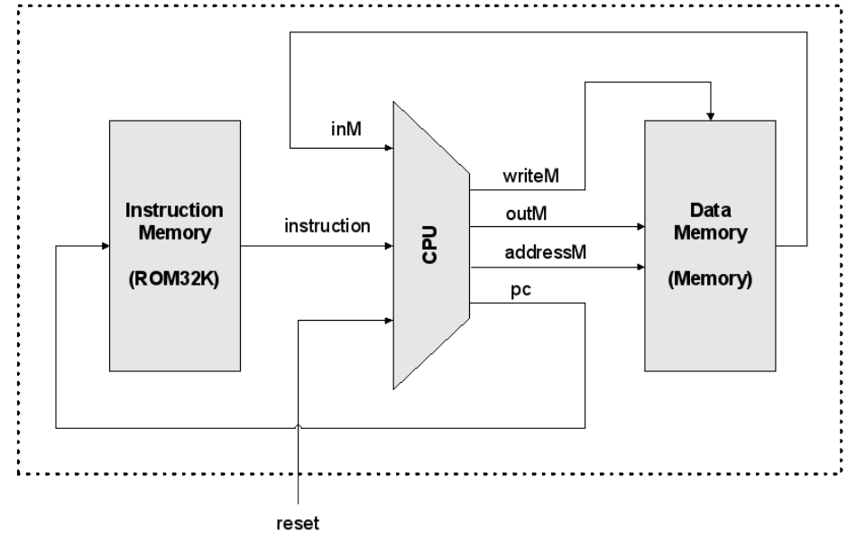
  Struttura del computer Hack.
  Esso presenta un’**architettura di tipo Von Neumann a 16-bit**, la quale presenta però una separazione tra memoria dati e memoria programma al fine di poter caricare contemporaneamente dati e istruzioni.
  I **dispositivi di input/output** utilizzati dall’utente per interfacciarsi con il computer Hack sono uno **schermo bianco e nero** composto da 256 x 521 px e una **tastiera**.
  Il **compito** del computer Hack è quello di prendere in modo sequenziale ogni istruzione memorizzata nella memoria ROM (1 word per ogni istruzione), decodificarla ed eseguirla, per poi passare all’operazione successiva. All’interno della ROM dunque è memorizzato il programma da eseguire, ed essendo una memoria Read-Only, per cambiare il programma da eseguire occorre sostituire l’intera ROM.

### Memoria


La memoria a 32K parole del computer Hack viene suddivisa nel seguente modo:

- **Data (16K)**: memorizza i dati utilizzati dai programmi in esecuzione.
- **Screen (8K)**: consente di leggere/scrivere sulla mappa dello schermo.
- **Keyboard (1 parola)**: consente di leggere il tasto premuto su tastiera.
  La **logica di accesso** alla memoria del computer Hack è la seguente:
- Indirizzi **0 - 16383** si accede al chip RAM16K.
- Indirizzi **16384 - 24575** si accede al chip Screen.
- Indirizzo **24576** si accede al chip Keyboard.
  Ogni altro indirizzo utilizzato in input non è valido.
  Viene utilizzata questa logica di indirizzamento in quanto, nonostante vengano lasciati inutilizzabili quasi 8k parole, permette di facilitare la scelta della giusta memoria da invocare tramite una valutazione degli ultimi due bit più significativi:
- Se i due bit più significativi sono **0x**, l’indirizzo può indirizzare da 0 a 16383, quindi si riferisce alla **memoria dati**.
- Se i due bit più significativi sono **10**, l’indirizzo può indirizzare da 16384 a 24575, quindi si riferisce alla memoria per lo **schermo**.
- Se i due bit più significativi sono 11 e il resto sono 0, l’indirizzo corrisponde a 24576, ovvero quello della **tastiera**.
  Questo fatto è dunque facilmente gestibile utilizzando una porta **DMux** e come selettore i due bit più significativi dell’indirizzo passato in input.
  **Memoria per le istruzioni**
  
  ROM del computer Hack.
  La memoria per le istruzioni del computer Hack, anche detta **ROM (Read only memory)**, è precaricata con un programma scritto in linguaggio macchina Hack.
  L’**ingresso** è costituito da 15 bit, i quali possono indirizzare $2^{15} (32k)$ indirizzi, mentre l’**uscita** a 16 bit indica la prossima istruzione in linguaggio macchina da inviare alla CPU ed eseguire.
  **Data memory**
  
  RAM del computer Hack.
  La memoria per i dati del computer Hack, anche detta RAM, presenta 3 input:
- **In**: dato da inserire in RAM[address] se load = 1.
- **Address**: indirizzo della RAM da leggere e/o scrivere (in base al valore di load).
- **Load**: 0 → legge RAM[address] inviandolo in out, 1 → scrive in in RAM[address] e lo invia in out.
  La RAM del computer Hack occupa **16k** parole da 16 bit della memoria dati.
  **Screen memory**
  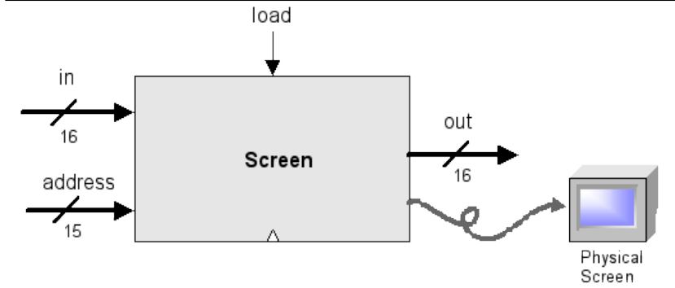
  Chip schermo del computer Hack.
  Lo schermo del computer Hack funziona in modo simile alla RAM, infatti presenta 3 input:
- **In**: pattern della sequenza di 16 bit all’indirizzo address (0: bianco, 1: nero) se load = 1.
- **Address**: indirizzo della sequenza da 16 bit da visualizzare e/o modificare (in base al valore di load).
- **Load**: 0 → legge Screen[address] inviandolo in out, 1 → modifica Screen[address] e lo invia in out.
  
  Mappa dello schermo del computer Hack.
  Come si vede dalla figura, i bit della memoria dati riservati allo schermo sono suddivisi in word da **16 bit**, dunque per modificarne uno occorre inserire in address l’indirizzo della word che lo contiene e inserire la sequenza corretta di bit in in per modificare il pixel scelto. Dunque per impostare il pixel (row, col) dello schermo per essere nero o bianco occorre modificare il bit **col%16** nell’input **in** a 0 (bianco) o 1 (nero) e inserire in **address → row\*32+col/16** (col/16 è una divisione intera), perchè 32 è il numero di parole in una riga e 16 il numero di bit in una parola, ovvero in una colonna.
  Lo schermo del computer Hack occupa **8k** parole da 16 bit nella memoria dati.
  **Keyboard memory**
  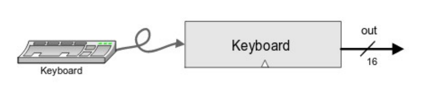
  Chip tastiera del computer Hack.
  La tastiera nel computer hack è un chip che prende in input il tasto premuto dal dispositivo di input “tastiera” e ne restituisce la corrispondente codifica in ASCII estesa a 16 bit. Se non viene premuto alcun tasto si restituisce 0.

### CPU


La **CPU (Control Processing Unit)** del computer hack esegue le instruction dategli in input seguendo le specifiche del linguaggio HACK. Questo lavoro viene processato dai seguenti componenti interni: ALU e 3 registri (A, D, PC).
**Registri**
I **registri** hanno lo stesso scopo della memoria principale, ovvero quello di memorizzare e leggere informazioni, ma permettono di farlo ad una velocità molto più elevata, in quanto si trovano all’interno della CPU, dunque il tragitto è più breve, e hanno memorie a parole singole, quindi non occorre svolgere il processo di ricerca e indirizzamento necessario per la RAM.
Nel computer HACK possiamo trovare 3 registri:

- **D** (Data): necessario per memorizzare informazioni per breve tempo, per esempio risultati temporanei di un operazione a più operandi.
- **A** (Addressing): utile per memorizzare l’indirizzo da prendere (leggere/scrivere) nella memoria principale o l’indirizzo a cui saltare nella memoria ROM.
- **PC** (Program Counter): memorizza l’indirizzo della prossima istruzione da prendere dalla memoria ROM in cui è salvato il programma da eseguire. Se c’è un jump allora all’interno di PC viene memorizzato il valore del registro A, altrimenti viene incrementato di 1.
  **Input e output della CPU**
  Gli input della CPU sono i seguenti:
- **inM**
  Qui viene inserito il valore della memoria all’indirizzo presente nel registro A nel caso in cui il valore M si si trovi nella parte destra dell’istruzione HACK.
- **instruction**
  Qui viene inserita l’istruzione in linguaggio HACK codificata in 16 bit presa dalla ROM.
- **reset**
  Può assumere il valore di 0 o 1.
  - **reset = 0**
    Viene controllato se c’è un jump tramite i due output della ALU zr e ng. In caso affermativo viene caricato il contenuto del registro A nel registro PC, altrimenti viene semplicemente incrementato di 1 il registro PC.
  - **reset = 1**
    Si mette a 0 il contenuto del registro PC.
    Quando il reset è a 0 dunque il programma presente nella memoria ROM viene eseguito, mentre quando il reset è a 1 l’esecuzione riparte. Dunque, per iniziare l’esecuzione di un programma, il reset deve essere prima impostato a 1 e poi a 0.
    Mentre questi sono gli output:
- **outM**
  Qui viene inserito l’output da memorizzare all’indirizzo della RAM indicato dall’output addressM nel caso in cui writeM = 0.
- **writeM**
  Può assumere il valore di 0 o 1. Nel primo caso legge solo dalla RAM all’indirizzo indicato da addressM inserendolo in inM, mentre nel secondo caso scrive anche outM all’indirizzo addressM della RAM.
- **addressM**
  Qui viene inserito l’indirizzo della RAM da accedere in lettura/scrittura.
- **pc**
  Qui viene inserito il contenuto del registro PC, il quale indica l’indirizzo della prossima istruzione da prendere dalla ROM ed eseguire nella CPU.
  
  Struttura interna della CPU.
  **Codifica delle A-instruction**
  
  Codifica delle A-instruction.
  Il primo bit a 0 indica che è una A-instruction, mentre i restanti 15 bit indicano l’indirizzo da inserire nel registro A.
  **Codifica delle C-instruction**
  
  Codifica delle C-instruction.
  Il primo bit a 1 indica che è una C-instruction, i seguenti due bit a 1 non indicano nulla di specifico, mentre i restanti bit indicano l’operazione HACK da eseguire codificata in binario secondo il seguente schema.
  
- **7.4 - Assemblatore**

- **7.4.1 - Assemblatore del computer Hack**

### Introduzione

L’**assemblatore** di un computer permette di tradurre del codice in linguaggio assembler a linguaggio macchina, eseguibile dalla CPU.
Per quanto riguarda il computer Hack, il suo assemblatore prende in input un file **.asm** contenente il programma di linguaggio assembler da essere eseguito, per poi restituire un file **.hack** contenente per ogni riga del primo file la corrispondente operazione codificata in codice binario a 16 bit. Noi costruiremo l’assemblatore per il computer Hack in linguaggio C, il quale utilizzo verrà trattato nella prossima sezione “Programmazione in C”.

Esempio di input e output dell’assemblatore.

### Programma assembly

Il **programma assembly** è un file con una sequenza di linee di testo. Tra queste quelle **importanti**, ovvero quelle che l’assemblatore deve controllare, possono essere di 3 tipologie:

- **A-instruction**
- **C-instruction**
- **Dichiarazione di etichette**
  Le restanti linee di testo invece non presentano la necessità di essere codificate in binario in quanto non devono essere eseguite dalla CPU. Esse possono presentare dei commenti, i quali iniziano con “\\”, spazi bianchi, tabulazioni (‘\t’) o simboli di fine linea (’\r’, ‘\n’).

### Traduzione in linguaggio macchina

**Traduzione di A-instruction**
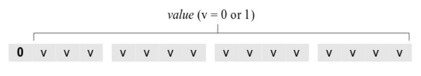
Codifica di una A-instruction.
Una A-instruction viene codificata impostando il **bit più significativo a 0**, in questo modo si riesce a distinguerla da una C-instruction.
**I restanti 15 bit** invece conterranno il valore in binario dell’indirizzo di memoria inserito nel campo **[value]** dell’istruzione. Come abbiamo visto il [value] di una A-instruction può contenere un numero oppure una stringa che rappresenta un simbolo (etichetta o variabile), dunque nella traduzione occorre separare questi 2 casi:

- [value] = numero
  È sufficiente inserire il valore binario corrispondente all’interno dei 15 bit riservati a value (il numero è sempre positivo, quindi non viene utilizzato il complemento).
- [value] = simbolo
  Occorre cercare il simbolo all’interno della symbol table, una tabella che contiene i nomi e i relativi valori dei simboli presenti all’interno dell’intero programma. La creazione di questa tabella verrà trattata in seguito nella sezione “Traduzione di simboli”.
  **Traduzione di C-instruction**
  
  Codifica delle C-instruction.
  Una C-instruction viene invece codificata impostando i **3 bit più significativi a 1**. Per quanto riguarda i restanti 13 bit invece questi vengono impostati a 0 o a 1 in base al seguente schema, il quale comprende tutte le possibili combinazioni di [dest], [comp] e [jmp] e la loro corrispondente codifica:
  
  **Traduzione di simboli (etichette e variabili)**
  
  La traduzione dei simboli avviene tramite la creazione preventiva della symbol table, che viene svolta in diverse passate che verranno trattate nella prossima sezione “passaggi della traduzione”.
  **Passaggi della traduzione**
  La traduzione del file in input in linguaggio macchina viene svolta in 3 passaggi:

1. Inserimento dei **simboli predefiniti**.
2. **Prima passata** del file in input (etichette): si scorre tutto il file di input in lettura per inserire le etichette in symbol table; per sapere che valore assegnare ad ogni etichetta si utilizza un contatore che aumenta ad ogni A o C instruction, e quando si incontra un’etichetta le si assegna il valore del contatore in quel momento.
3. **Seconda passata** del file in input (istruzioni + variabili): si scorre tutto il file di input in lettura e si apre il file di output in scrittura al fine di scriverci il valore in linguaggio macchina corrispondente ad ogni A e C instruction. Per le A instruction che presentano un simbolo si cerca il valore corrispondente in symbol table, se assente lo si inserisce assegnandogli un valore da 16 in poi.

   Nota: il file di output finale presenterà la codifica di ogni linea con una A o C instruction.

- **7.4.2 - Programmazione in C**

- **Compilazione**
  Il compilatore C lavora seguendo i seguenti passaggi:

  1. **Preprocessore**: trasforma i file sorgente in base alle **preprocessor directives** che contengono. Le principali preprocessor directives sono le seguenti:

     - **#include “**[headerName]**”**: includere un file esterno.
     - **#define** [token] [code]: definire una macro.
     - **#ifdef** [token] … **#endif**: se una macro è definita esegue il codice dopo l’if, altrimenti esegue l’else.
       ```c
       #ifdef <token>
       /* code */
       #else
       /* code to include if the token is not defined */
       #endif
       ```
     - **#ifndef** [token] … **#endif**: se una macro non è definita esegue il codice dopo l’if, altrimenti esegue l’else.

     Per terminare la compilazione dopo il preprocessore e ottenere il risultato in output occorre eseguire il seguente comando da terminale:

     ```c
     gcc -E [files]
     ```

     Con il seguente comando invece si ottiene in output un file assembly human readable per ogni file .c passato nel comando:

     ```c
     gcc -S [files]
     ```

  2. **Compilatore**: genera il **codice oggetto**, ovvero dei file con estensione .o in linguaggio macchina corrispondenti ai file c dati in input. Questi file non sono ancora eseguibili in quanto mancano ancora i riferimenti da istanziare, come ad esempio le invocazioni delle funzioni di libreria.

     Per terminare la compilazione dopo il compilatore e ottenere un file oggetto per ogni file passato nel comando, occorre eseguire il seguente comando da terminale:

     ```c
     gcc -c [files]
     ```

  3. **Linking**: collega i vari file oggetto creati nella fase di compilazione e le librerie statiche utilizzate per creare un unico file eseguibile.

     Per ottenere un file eseguibile ottenuto dopo il linking occorre eseguire da terminale il seguente comando:

     ```c
     gcc -o [outputFile] [inputFiles]
     ```

     Per eseguire un file eseguibile ottenuto dopo la compilazione è necessario eseguire da terminale il seguente comando:

  ```c
  ./[outputFile]
  ```

  ./ serve per indicare alla shell di cercare l’eseguibile nella current directory, visto che la current directory non è solitamente tra quelle dove un eseguibile viene cercato.
  Un modo per velocizzare la compilazione per un programma scritto in più file è quello di utilizzare l’utility **make**, la quale richiede la creazione preventiva di un file chiamato **makefile**, nel quale vengono dichiarate le istruzioni di compilazione. Un esempio di makefile è il seguente:

  ```c
  main: main.o somma.o
    gcc -o main main.o somma.o
  main.o: main.c somma.h
    gcc -c main.c
  somma.o: somma.c somma.h
    gcc -c somma.c
  clean:
    rm *.o main
  ```

  Dopo aver creato il makefile è sufficiente lanciare il comando **make** o **MinGW32-make** (se si utilizza MinGW) da terminale, oppure **make** [commandName] per eseguire un singolo comando del makefile.
  Tra i benefici dell’utilizzo del make, oltre alla maggiore velocità di compilazione vi è il fatto che, grazie alla specifica delle dipendenze per ogni comando, ricompila solo le parti che sono state modificate.

- **Sintassi (differenze con C++)**

  ### Input e output

  ```c
  printf([formatString], [arg1], [arg2], [arg3], ...);
  ```

  - **%d**: stampa un intero.
  - **%f**: stampa un float.
  - **%lf**: stampa un double.
  - **%s**: stampa una stringa.
  - **%c**: stampa un singolo carattere.

  ```c
  scanf([formatString], [arg1], [arg2], [arg3], ...);
  ```

  - **%d**: legge un intero.
  - **%f**: legge un float.
  - **%lf**: legge un double.
  - **%s**: legge una stringa.
  - **%c**: legge un singolo carattere.

  ### Strutture

  ```c
  typedef struct {
    [type1] [field_name1];
    [type2] [field_name2];
  } [struct_name];
  ```

  ```c
  [struct_name] [var_name];
  [var_name].[field_name1] = [value];
  ```

  ### Puntatori

  Per utilizzare le seguenti funzioni occorre includere la libreria <stdlib.h>.

  ```c
  malloc([size]);
  ```

  ```c
  free([pointer]);
  ```

  ### File

  Per poter accedere ad un file in lettura/scrittura occorre dichiarare un puntatore a file di tipo \*FILE (per utilizzare FILE occorre importare la libreria **stdio.h**).

  ```c
  #include <stdio.h>

  FILE *file;
  file = fopen([fileName], "r\w");
  ```

  Per leggere e scrivere su file vengono utilizzate le funzioni corrispondenti a printf e scanf chiamate **fprintf** e **fscanf**.

  ```c
  fscanf([file], [formatString], [arg1], [arg2], [arg3], ...);
  ```

  ```c
  fgets([stringVar], [maxChar], [file]);
  ```

  ```c
  feof([file]);
  ```

  ```c
  fprintf([file], [formatString], [arg1], [arg2], [arg3], ...);
  ```

  Quando un file non viene più usato deve essere chiuso usando **fclose**.

  ```c
  fclose([file]);
  ```

  ### Parametri passati da linea di comando

  È possibile passare dei parametri al programma tramite linea di comando. Per farlo occorre dichiarare la funzione main in questo modo:

  ```c
  int main(int argc, char **argv)) {
    // code
  }
  ```

  **Argc** contiene il numero di parametri passati, compreso il nome del programma, mentre **argv** è un array di stringhe, una per argomento, che ha come primo valore argv[0] il nome del programma.

  ### Funzioni utili

  ```c
  sizeOf([var/type]);
  ```

- **8.0 - Sistema operativo**
  Le risorse messe a disposizione dall’architettura di un elaboratore vengono gestite da una componente software che prende il nome di sistema operativo. Tra i compiti principali del sistema operativo troviamo la gestione della memoria, dei processi (programmi in esecuzione), e delle periferiche di I/O.
  
  Struttura di un comune sistema UNIX.
  Come vediamo dalla figura, nei sistemi UNIX shell e programmi applicativi interagiscono con il sistema operativo tramite chiamate di sistema (es. operazioni di accesso a file, interruzione di un programma ecc.).
- **8.1 - Paginazione**
  Siccome vi è sempre una grande differenza tra la dimensione della memoria primaria e di quella secondaria per via della differenza nei costi di produzione, è stata inventato la tecnica della **paginazione**, gestita dal sistema operativo, per far sì che si riesca ad utilizzare tutta la memoria secondaria inserendo parti di essa in maniera temporanea all’interno della memoria principale al fine poterci lavorare.
  
  **Pagine e blocchi di memoria**
  La memoria secondaria viene dunque chiamata **memoria virtuale**, la quale viene divisa in blocchi di dimensione **m**, la quale deve essere una potenza di 2, detti **pagine**. Anche la memoria principale viene divisa in blocchi di dimensione m, chiamati **blocchi di memoria**, nei quali verranno inseriti le pagine nel momento del bisogno.
  
  a) Primi 64 KB degli indirizzi virtuali suddivisi in 16 pagine da 4 KB. b) Memoria principale da 32 KB suddivisa in otto blocchi di memoria da 4KB.
  **Traduzione da indirizzo virtuale ad indirizzo reale**
  Esiste hardware dedicato, chiamato **MMU (Memory Management Unit)**, che si trova all’interno della CPU e si occupa di tradurre un indirizzo virtuale nel corrispondente indirizzo reale.
  Per fare ciò l’MMU utilizza una **tabella delle pagine**, la quale indica per ogni pagina se è presente in memoria principale e, in caso affermativo, l’indirizzo del blocco di memoria in cui trovarla.
  Siccome abbiamo detto che la dimensione delle pagine è una potenza di 2, allora esisterà un numero **k** tale che $2^k = m$. K sarà dunque il numeri di **bit meno significativi** dell’indirizzo virtuale da utilizzare per prendere il giusto dato all’interno del blocco di memoria.
  I **restanti bit** dell’indirizzo virtuale vengono invece utilizzati per trovare la giusta pagina all’interno della tabella delle pagine e controllare, tramite il **bit presente/assente**, se questa è già presente all’interno della memoria principale. In caso affermativo viene formato l’indirizzo virtuale aggiungendo ai k bit meno significativi i bit presenti all’interno della tabella delle pagine che indicano l’indirizzo del blocco di memoria da utilizzare nella memoria principale.
  Il tutto è spiegato in maniera schematica nella seguente figura:
  
  Formazione di un indirizzo fisico a partire da un indirizzo virtuale.
  **Algoritmi di paginazione**
  Le pagine al momento in memoria principale vengono dette **working set**. È possibile però che si provi ad accedere ad una pagina non presente nella memoria principale e quindi nel working set, e in quel caso avviene un trap chiamato **page fault**.
  Il gestore di tale trap ha il compito di inserire la nuova pagina all’interno della memoria principale, e nel caso in cui quest’ultima è piena è suo compito liberare un blocco di memoria per fare spazio alla nuova pagina. La scelta del blocco di memoria da eliminare viene presa attraverso i cosiddetti **algoritmi di paginazione**. Due tipici algoritmi di paginazione sono i seguenti:
- **LRU (Least Recently Used)**
  Viene rimossa la pagina che da più tempo non viene utilizzata.
  Possibile implementazione: si può utilizzare una lista; quando si accede ad una pagina la si inserisce in coda, e quando serve rimuovere una pagina, si rimuove quella in testa alla lista.
- **FIFO (First In First Out)**
  Viene rimossa la pagina che da più tempo è in memoria.
  Possibile implementazione: ogni blocco ha un contatore, il quale viene inizializzato a 0 quando il blocco riceve una nuova pagina e vengono tutti incrementati ogni volta che avviene un page fault. Quando serve liberare un blocco si sceglie quello con il contatore più alto.
  **Dirty bit**
  Quando si rende necessario liberare un blocco, non sempre è necessario ricopiare in memoria secondaria la pagina contenuta. Infatti, se la pagina non è stata modificata da quando è stata inserita nella memoria principale non ha senso reinserirla in memoria secondaria.
  Per evitare di perdere tempo in inutili operazioni di ri-scrittura, si usa la tecnica del dirty bit: ogni blocco in memoria principale ha un bit associato, chiamato **dirty bit**, il quale viene messo a 0 quando viene caricata una nuova pagina, e viene messo a 1 quando il contenuto del blocco viene acceduto in scrittura. Quando si deve liberare un blocco dunque, si salva la corrispondente pagina in memoria solo se il dirty bit è uguale a 1.
- **8.2 - Segmentazione**
  **Frammentazione interna**
  Nell’utilizzo della tecnica della paginazione, se ad un programma serve una quantità di memoria che non è un multiplo della dimensione di una pagina, l’ultima pagina che verrà inserita in memoria principale non occuperà tutto lo spazio disponibile, lasciando dei bit inutilizzati.
  Questo problema prende il nome di **frammentazione interna**, in quanto lo spazio inutilizzato si trova all’interno di una pagina.
  **Segmentazione**
  Un modo per ovviare a questo problema è quello di usare blocchi di memoria di dimensione variabile, chiamati **segmenti**.
  In questo modo un programma può decidere di utilizzare diversi blocchi di memoria differenti per diversi scopi dividendo in questo modo la memoria in **blocchi di diversa dimensione**.
  
  Esempio di segmentazione della memoria.
  I vari segmenti utilizzati da un programma sono visibili al programmatore, e siccome tutti i segmenti vengono trattati come se fossero memorie separate tra loro, gli indirizzi delle loro locazioni **partono tutte da 0**. Per disambiguare l’uso degli indirizzi occorre dunque specificare nell’indirizzo anche l’indice relativo al segmento in cui si trova la cella di memoria interessata. L’indirizzo **(n, k)** indica quindi la locazione k del segmento n. Per trasformarlo l’indirizzo in un indirizzo reale quindi la MMU utilizza una tabella dei segmenti, la quale per ogni segmento presente in memoria indica l’indirizzo di inizio e la sua dimensione.
  **Frammentazione esterna**
  Come nella paginazione, anche nella segmentazione vengono inseriti in memoria principale solo i segmenti utilizzati, lasciando in memoria secondaria i segmenti che sono al momento inutilizzati.
  Quando serve inserire un nuovo segmento all’interno della memoria secondaria, però, è possibile che lo spazio disponibile non sia sufficiente, e in questi casi occorre togliere uno o più dei segmenti già in memoria. Questa tecnica è detta **swapping**, e a seguito di questo processo si possono generare zone inutilizzate, generando il problema della **frammentazione esterna**, chiamata così in quanto lo spazio inutilizzato si trova all’esterno del segmento.
  
  (a - d) Incremento della frammentazione esterna. (e) Rimozione della frammentazione esterna tramite compattamento.
  **Gestione della frammentazione**
  Le zone non utilizzate nel fenomeno della frammentazione esterna sono dette lacune, e per limitare la loro creazione sono state ideate delle tecniche particolari di inserimento di nuovi segmenti:
- **Best fit**: il nuovo segmento va inserito nella lacuna più piccola che riesce a contenerlo.
- **First fit**: si scorrono le lacune circolarmente, inserendo il nuovo segmento nella prima lacuna abbastanza grande da contenerlo.
  First fit è consigliabile rispetto al best fit in quanto è più veloce nella scelta della lacuna e limita inoltre la creazione di lacune molto piccole e quindi inutili.
  **Combinazione fra paginazione e segmentazione**
  Un modo di utilizzare la segmentazione evitando la frammentazione esterna è quella di combinarla con la paginazione. In questo modo i segmenti vengono divisi in pagine e tali pagine vengono spostate in memoria seguendo la tecnica già studiata per la paginazione. In questo modo c’è però più lavoro da parte della MMU per tradurre gli indirizzi e ogni segmento richiede una tabella delle pagine propria.
  
  Conversione di un indirizzo MULTICS a due parti in un indirizzo fisico.
- **8.3 - Collegamento di un programma**
  Un programma può essere composto da più file distinti, ad esempio un programma c++ composto da più file .cpp, ognuno dei quali può essere compilato in maniera distinta creando dei moduli oggetto. Per ottenere però il programma pronto per l’esecuzione occorre svolgere una fase di **collegamento**, la quale viene effettuata dal cosiddetto **linker**. Viene solitamente utilizzata questa procedura in quanto se si compilasse sempre tutto all’interno di un unico file, un piccolo cambiamento all’interno di uno dei file del programma comporterebbe la necessità di dover ricompilare tutto il programma. Modularizzando il programma invece si ha la possibilità di compilare solo il file modificato, dovendo poi effettuare il linking di tutti i file oggetto, il quale è più veloce della compilazione.
  
  Generazione di un file eseguibile a partire da un gruppo di file sorgenti tradotti indipendentemente.
  Ogni singolo modulo viene tradotto assumendo di utilizzare un proprio spazio di indirizzi che inizia da 0. Durante il collegamento il linker unisce tutti i singoli moduli oggetto in un unico file eseguibile scegliendone l’ordine e inserendo all’inizio informazioni di servizio necessarie per eseguire il programma (es. il vettore di interrupt, cioè il puntatore ai servizi di interrupt).
  **Rilocazione**
  Il problema però risiede nel fatto che dopo l’unione dei file oggetto gli indirizzi tradotti nei file oggetto devono essere **rilocati**, ovvero modificati per rispecchiare quelli reali. Per fare ciò, dopo aver unito i moduli oggetto insieme, si tiene traccia della lunghezza e dell’indirizzo di inizio di ogni modulo creando una tabella con gli indirizzi di inizio di ogni modulo. Così facendo si riesce a rilocare gli indirizzi presenti nella seguente maniera:
- I **riferimenti interni**, ovvero indirizzamenti all’interno dello stesso modulo oggetto, vengono rilocati aggiungendo al loro valore l’indirizzo di inizio del modulo.
- I **riferimenti esterni**, ovvero indirizzamenti esterni al modulo oggetto in questione, vengono rilocati utilizzando una tecnica più complicata. Per farlo infatti si ha bisogno di informazioni aggiuntive rispetto al primo caso, quindi nella creazione di ogni modulo oggetto viene sempre inserito un **dizionario di rilocazione**, in cui vengono inseriti tutti gli indirizzi che sono potenzialmente da rilocare, e in questo modo il modulo A, quello da rilocare, indica al linker che usa il simbolo esterno nel modulo B, e il modulo B deve dire a che indirizzo interno corrisponde il simbolo che esporta. Con queste informazioni, più la tabella con gli indirizzi di inizio di ogni modulo, si riesce a rilocare in modo corretto i riferimenti esterni di ogni modulo.
  
  Composizione di un modulo oggetto prodotto da un compilatore.
  Esempio:
- Facciamo l’esempio di un programma composto da 4 moduli, in ognuno dei quali vengono utilizzate le stesse 3 istruzioni BRANCH (istruzione di salto), MOVE (sposta dati da registri a memoria e viceversa) e CALL (invoca una procedura che si può anche trovare all’interno di un altro modulo oggetto). Come possiamo notare dalla figura ogni modulo ha il proprio spazio di indirizzi, che inizia da 0.
  
  Il linker unisce i moduli oggetto scegliendo l’ordine e inserendo all’inizio 100 bit per le informazioni di servizio. A seguito dell’unione gli indirizzi non sono più corretti in quanto viene utilizzato un unico spazio di indirizzi, dunque occorre svolgere la rilocazione nelle modalità viste.
  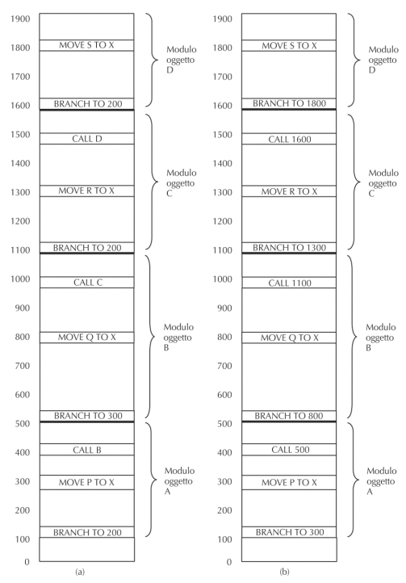
  a) I moduli oggetto dopo essere stati uniti nell’immagine binaria, ma prima di essere collegati e rilocati. b) Gli stessi moduli oggetto dopo aver effettuato il collegamento e la rilocazione.
  **Rilocazione a tempo del binding**
  Nei sistemi multiprogrammati, ovvero sistemi che possono eseguire più di un programma contemporaneamente, un programma può essere letto, portato nella memoria centrale, eseguito e riportato su disco, per poi rieffettuare gli stessi passaggi una volta che viene rieseguito.
  In questi casi è molto improbabile che il programma venga reinserito in memoria centrale sempre nella stessa posizione, dunque è necessario effettuare una rilocazione ogni qualvolta un programma viene eseguito, e il momento in cui vengono assegnati i nuovi indirizzi viene chiamato **tempo del binding**, ovvero tempo del collegamento.
  
  Programma dell’esempio precedente spostato di 300 posizioni. Deve essere rilocato in quanto molte istruzioni si riferiscono ora a indirizzi di memoria errati.
  **Collegamento dinamico**
  In alcuni casi, le invocazioni di procedura utilizzate all’interno di un programma non vengono inserite nell’eseguibile, ma vengono collegate direttamente nel momento dell’esecuzione. Questo avviene per una serie di procedure che solitamente fanno parte delle cosiddette **librerie dinamiche** (es. libreria DLL di Windows), al fine di non doverle inserire nell’eseguibile di tutti i programmi che le usano e evitando la modifica di ognuna delle loro copie ogni qualvolta avviene un aggiornamento.
  Un modo per implementare il collegamento dinamico è quello di inserire nel codice oggetto del programma il nome della procedura da richiamare, e quando si arriva all’esecuzione di tale procedura viene effettuata una chiamata ad un **indirizzo sbagliato** la quale genera una **trap**. In questo modo il gestore della trap cerca l’indirizzo in cui si trova la procedura utilizzando il suo nome che come abbiamo detto si trova nel codice eseguibile. Una volta trovata la procedura si inserisce nel codice il salto all’indirizzo trovato, e in questo modo nuove esecuzioni del programma non genereranno più trap.
- 9**.0 - Virtual Machine**
  Una virtual machine rappresenta una macchina ipotetica, la quale esiste virtualmente e non fisicamente. Essendo definita come una macchina vera e propria, però, la virtual machine presenta un suo linguaggio appartenente al livello ISA, i quali programmi scritti in questo linguaggio possono essere eseguiti in essa.
  Questo linguaggio, detto linguaggio di **virtual machine**, viene spesso utilizzato nella compilazione a 2 livelli, in quanto può rappresentare uno step intermedio tra linguaggio ad alto livello e linguaggio assembler (es. JVM di Java e BEAM di Erlang e Elixir).
  Nella **compilazione a 2 livelli** il primo livello dipende solo dai dettagli del linguaggio sorgente, mentre il secondo livello dipende solo dai dettagli del linguaggio target. Questo consente di utilizzare lo stesso programma compilato in linguaggio di virtual machine su architetture diverse, sempre che queste abbiano il compilatore di virtual machine.
  
  Differenza tra compilazione diretta e compilazione a 2 livelli.

- **9.1 - Linguaggio per virtual machine**
  Ciascuna virtual machine non fa riferimento ad una specifica architettura, e il linguaggio che noi utilizzeremo è basato sui seguenti comandi:
  **Arithmetic/Boolean commands**
- **add**
- **sub**
- **neg**
- **eq**
- **gt**
- **lt**
- **and**
- **or**
- **not**
  **Memory access commands**
- **pop** [var]
- **push** [var/const]
  **Program flow commands**
- **label** [labelName]
- **goto** [labelName]
- **if-goto** [labelName] // fa il salto solo se l’ultimo elemento nello stack non è 0
  **Function calling commands**
- **function** [funName] [localVarNum] // dichiarazione di una funzione
- **call** [funName] [argsNum] // chiamata a funzione, prende il numero degli argomenti inseriti dagli ultimi valori presenti nello stack
- **return**
- **9.2 - Modello a stack**
  La virtual machine si basa su un **modello a stack** nel quale viene considerato un unico tipo di dato a 16 bit utilizzato per interi, booleani e puntatori.
  **Arithmetic/Boolean commands**
  
  Spiegazione dei comandi aritmetico/booleani della virtual machine.
  Per via del modello a stack i comandi aritmetico/booleani della virtual machine si basano principalmente su questi **3 passaggi**:

1. **Pop** dei valori in cima allo stack. Il numero dei valori sui quali viene richiamato il comando pop varia in base al tipo di funzione che si vuole richiamare su di essi (unaria, binaria ecc.).
2. Calcolo del risultato di una qualche funzione **f(**[var1]**,** [var2]**, …)**.
3. **Push** del risultato in cima allo stack.
   **Memory access commands**
   I comandi di accesso in memoria **pop** e **push** lavorano utilizzando lo stack e la memoria nel seguente modo:
   
   **Function calling commands**
   Le **chiamate a funzione** della virtual machine utilizzano **segmenti di memoria**, ovvero spazi di indirizzamento virtuale con dimensioni differenti a seconda dello scopo.

- Esistono due segmenti, **static** e **constant**, sempre accessibili in quanto sono condivisi da tutte le funzioni. Il primo contiene tutte le variabili globali, mentre il secondo, dal quale si può solo leggere, contiene tutte le costanti.
- Ogni funzione in esecuzione inoltre utilizza due propri segmenti, **argument** e **local**, che vengono creati prima dell’esecuzione e distrutti al termine. Il primo contiene gli argomenti utilizzati nella chiamata di funzione, mentre il secondo contiene tutte le variabili locali della funzione.
  Un singolo indirizzo di interesse all’interno di un segmento viene richiamato tramite la sintassi [segmentName] [num]:
- **constant** [num]: num indica il valore costante da utilizzare.
- **argument** [num]: num indica l’indice dell’argomento della funzione, partendo da 0 per il primo argomento.
- **local** [num]: num indica l’indice della variabile locale della funzione, partendo da 0 per la prima variabile.
  Esempio:
- Presentiamo un esempio di funzione scritta in un linguaggio ad alto livello e tradotta nel linguaggio virtual machine appena visto. Vediamo anche come si comporta la memoria appena la funzione viene richiamata e subito dopo la sua esecuzione.
  
  **Organizzazione della memoria**
  La memoria utilizzata da un programma scritto nel linguaggio virtual machine che abbiamo visto è organizzata nel seguente modo:
- I **primi 16 indirizzi** vengono utilizzati a livello di **implementazione della virtual machine**. In particolare nei primi 3 indirizzi troviamo **SP (Stack Pointer)**, **LCL (Local segment Pointer)** e **ARG (Argument segment Pointer)**.
- Gli **indirizzi da 16 a 255** vengono utilizzati per il **segmento static**.
- Gli **indirizzi da 256 a 2047** vengono utilizzati per lo **stack** e per i **segment argument e local** creati al momento dell’invocazione di funzioni.
- Gli **indirizzi successivi** vengono utilizzati per l’**heap**.
  
  Esempio del modello a stack per il comando **add**.
- **9.3 - Subroutine**

### Subroutine

Le **subroutine** sono delle astrazioni implementabili all’interno dei linguaggi di programmazione al fine di estenderne la loro potenza. Solitamente per fare ciò vengono utilizzate funzioni il quale funzionamento è simile a quello dei comandi primitivi del linguaggio di programmazione, in questo modo le estensioni risulteranno trasparenti.
Nel linguaggi di virtual machine che abbiamo visto le subroutine devono essere implementate seguendo il seguente schema. Il chiamante deve fare **push degli argomenti** nello stack prima di richiamare la funzione implementata come subroutine. Appena il chiamante svolge la chiamata a funzione vengono inserite nello stack le **risorse necessarie** alla funzione chiamata per funzionare in maniera corretta, tra le quali troviamo il segmento per gli argomenti, quello per lo stato del chiamante al fine di ritornare allo stesso stato quando la funzione termina la sue esecuzione, e il segmento per le variabili locali della funzione. Prima del return la funzione chiamata deve fare **push del valore di ritorno** e dopo il return le risorse usate dalla funzione chiamata vengono rilasciate e viene **ripristinato lo stato** presente al momento della chiamata della funzione. L’effetto di tutto ciò è quello che la funzione chiamata consuma gli argomenti e lascia il valore di ritorno in cima allo stack esattamente come succede nei comandi primitivi della virtual machine (add, or, not ecc.).
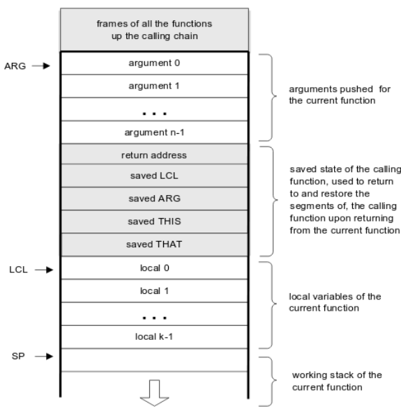
Stack durante l’esecuzione della subroutine.
Esempio:

- Vediamo un esempio di catena di chiamate di funzione e di come viene gestito lo stack durante la loro esecuzione.
  
  Esempio di catena di chiamate.
  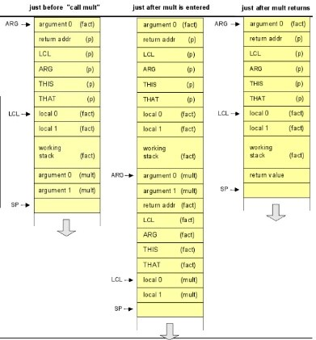
  Evoluzione dello stack durante le chiamate.
- **Esercizi**

```nasm
// x = (((x+5) - 3) > 0) OR (y = (y==2 AND z))

push x
push 5
add

push 3
sub

push 0
gt

push y
push 2
eq

push z
and

pop y

push y
or

pop x
```

```nasm
// function dummy(x, y) {

// 	int z = 0;

// 	if(x > y)
// 		return x;
// 	else
// 	{
// 		z = y + 3;
// 		return z > x;
// 	}
// }

fun dummy 2

push constant 0
pop local 0

push argument 1
push argument 0
gt
if-goto else

push argument 0
return

label else
push argument 1
push constant 3
add
pop local 0

push local 0
push argument 0
gt

return
```

```nasm
// inserisce nello stack i primi 20 numeri primi

// function rest(x, y) {
// 	while (x >= y) x -= y;
// 	return x;
// }

function rest 2

label while
// while (x >= y)
push argument 0
push argument 1
lt
if-goto exit_while

// x -= y
push argument 0
push argument 1
sub
pop argument 0

goto while

label exit_while
push argument 0
return

// function is_prime(x) {
    int i = 2;
    bool prime = true;

    while (i < x && prime) {
            if (rest(x, i) == 0) prime = false;
            else i++;
    }

    return prime;
}

function is_prime 1

// int i = 2
push constant 2
pop local 0

// bool prime = false
push constant 0
pop local 1

label while
// while (i < x && prime)
push local 0
push argument 0
lt
push local 1
and
not
if-goto exit_while

// if (rest(x, i) == 0)
push argument 0
push local 0
call rest 2
push constant 0
eq
not
if-goto else

// prime = false
push constant 0
pop local 1
goto skip_else

label else
// i++
push local 0
push constant 1
add
pop local 0

label skip_else
goto while

label exit_while

push local 1
return

// --------------------

 function primes_before_20() {
    int i = 0;
    while (i < 20) {
        i++;
        if (is_prime(i)) push i;
    }
    return;
}

function primes_before_20 0

// int i = 0
push constant 0
pop local 0

label while
// while (i < 20)
push local 0
push consant 20
lt
not
if-goto exit_while

// if (is_prime(i))
push local 0
call is_prime 1
not
if-goto skip_if

push local 0

label skip_if
// i++
push local 0
push constant 1
pop local 0

label exit_while
return
```

- **10.0 - Debugging**
  - **10.1 - Errori nei programmi**
    ### Errori nei programmi
    Un programma **funziona** solo quando restituisce i valori attesi sotto ogni condizione.
    Per questo motivo durante lo sviluppo di un programma bisogna sempre fare **testing** al fine di verificare che funzioni sotto gran parte degli input. Spesso infatti è molto difficile fare testing sotto ogni tipo di input in quanto sono tipicamente un numero molto alto, e in questi casi per assicurare la correttezza del codice occorre fare **verifica**, la quale però è molto complessa e costosa e viene svolta solo per programmi safety-critical. Solitamente, visto che molti programmi sono composti da funzioni, è utile svolgere l’**unit testing**, ovvero il test di ogni singola funzione definendo un semplice main che consente di testarle con vari parametri, anche sotto i casi più inaspettati al fine di essere confidenti della loro correttezza.
    Noi ci concentreremo solo sugli errori funzionali, ovvero errori che si presentano quando il programma non fa quello che deve fare, per via del fatto che ancora non abbiamo le competenze per analizzare gli errori non funzionali, come le performance, la scalabilità e l’usabilità. Esistono 3 categorie di errori funzionali: di compilazione, a runtime e logici.
    **Errori di compilazione**
    Gli **errori di compilazione** corrispondono agli errori notificati dal compilatore tramite un messaggio di errore (es. errori di sintassi, utilizzo di una variabile non dichiarata ecc.).
    **Errori a runtime**
    Gli **errori a runtime** sono errori che si verificano durante l’esecuzione di un programma e ne causano l’interruzione. Errori di questo tipo sono ad esempio la divisione per 0 o il segmentation fault, ovvero l’accesso ad un’area di memoria al di fuori del programma.
    **Errori logici**
    Gli **errori logici** sono errori che si verificano quando il programma esegue in modo normale ma il risultato non è sempre quello atteso. Questi tipi di errori sono i più complicati da individuare.
    **Errori classici**
    Gli errori classici della programmazione vengono solitamente individuati dal compilatore e segnalati come warning, come accade per l’assegnamento al posto di una condizione o la creazione di variabili non usate.
    Altri errori comuni sono l’off by one, anche detto Obi-Wan, il quale si presenta quando un ciclo esegue una volta in più o in meno di quanto dovrebbe, oppure gli errori nei casi limiti dell’input (es. stringa vuota, 0 ecc.).
  - **10.2 - Tecniche di debugging**
    ### Tecniche di debugging
    Esistono diverse **tecniche di debugging**, tra queste le più utilizzate sono quella **“a mano”** e quella dell’utilizzo del **debugger**.
    Per il primo tipo di debugging vengono utilizzate delle **stampe ausiliare** per capire il **flusso dell’esecuzione**, ovvero per comprendere se il programma passa per certi punti, oppure gli **stati intermedi**, i quali vengono verificati stampando il valore delle variabili.
    L’utilizzo del debugger è invece una tecnica di debugging molto più avanzata in quanto consente di verificare il flusso dell’esecuzione e gli stadi intermedi in maniera molto **più semplice e veloce**, ma richiede l’utilizzo di un tool chiamato debugger, il quale è integrato nella maggior parte degli ambienti di sviluppo.
